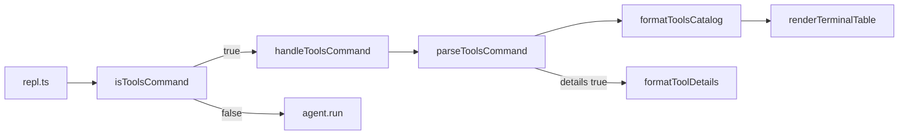

# CLI `/tools` Table Output

> **For agentic workers:** REQUIRED SUB-SKILL: Use superpowers:subagent-driven-development (recommended) or superpowers:executing-plans to implement this plan task-by-task.

**Goal:** Improve REPL UX so `/tools` prints a scannable table of all registered tools (name, description, schema summaries, built-in status). Full input/output schemas are shown only when the user passes the optional `details` flag: `/tools details`.

**Architecture:** Keep registry APIs unchanged. Add a CLI-only formatter module that loads each tool's full manifest + approval via existing `ToolRegistry` methods, renders a fixed-column **terminal table** (ASCII-safe characters only) with compact schema summaries, and optionally appends per-tool detail blocks with pretty-printed JSON. Wire strict command parsing into [`packages/cli/src/repl.ts`](packages/cli/src/repl.ts) so `/tools` (default) shows table only and `/tools details` adds the schema detail section. Extract REPL dispatch into a testable helper.

**Tech Stack:** Node.js (no new dependencies), `@meta-agent/core` types, existing `node:test` harness in CLI package.

---

## Conventions (review fixes)

### Terminal table, not Unicode box-drawing

Use the term **terminal table** throughout (not "ASCII table"). All rendered output uses **7-bit ASCII** only:

| Use | Character | Do not use |
|-----|-----------|------------|
| Column separator line | `-` (hyphen) | `─` (U+2500) |
| Ellipsis in truncated cells | `...` (three dots) | `…` (U+2026) |
| Detail section divider | `-- name --` | `── name ──` |

Tests must assert exact ASCII output (no Unicode punctuation).

### Newline contract

`formatToolsCatalog()` and `parseToolsCommand()` usage strings return **no trailing newline**. The REPL prints with `console.log(output)`, which adds exactly one trailing newline. Example: empty registry returns `"No tools registered."` (not `"No tools registered.\n"`).

### Description in detail blocks

When `details: true` and the table truncated the description (>50 chars), the detail block includes a separate line:

```
-- llm_generate --
  Description: <full untruncated text>
  Input schema:
    ...
```

When the description was not truncated, omit the `Description:` line. Do not embed full description text in the `-- name --` header line.

---

## Current behavior

[`packages/cli/src/repl.ts`](packages/cli/src/repl.ts) line 75:

```typescript
if (line === "/tools") { console.log(JSON.stringify(registry.listSync(), null, 2)); continue; }
```

`listSync()` returns only [`ToolSummary`](packages/core/src/types.ts): `{ name, description, hash, kind }` — no schemas, no built-in flag.

Full data lives on `Tool.manifest` (`inputSchema`, `outputShape`) and `ApprovalRecord.approvedBy` (built-ins use `"builtin"` — see [`packages/core/src/agent/builtins.ts`](packages/core/src/agent/builtins.ts)).

## Command syntax

| Input | Behavior |
|-------|----------|
| `/tools` | Table only (default) |
| `/tools details` | Table + per-tool input/output schema detail blocks |
| `/tools foo` (unknown flag) | Print usage hint, do not crash |
| `/toolsfoo`, `/tools-json` | **Not** handled by `/tools` — fall through to agent task dispatch |

Usage hint (one line, no trailing newline):

```
Usage: /tools [details]
```

### Strict command matching

Only lines matching `/^\/tools(\s|$)/` are `/tools` commands. Implementation:

```typescript
/** True when line is /tools or /tools <args> — not /toolsfoo or /tools-json. */
export function isToolsCommand(line: string): boolean {
  return /^\/tools(\s|$)/.test(line.trim());
}
```

`parseToolsCommand(line)` is only called when `isToolsCommand(line)` is true. Args after `/tools` are split on whitespace, empty tokens dropped:

- `[]` → `{ ok: true, details: false }`
- `["details"]` → `{ ok: true, details: true }`
- anything else → `{ ok: false, usage: "Usage: /tools [details]" }`

Update the REPL startup banner in [`packages/cli/src/repl.ts`](packages/cli/src/repl.ts) from `Commands: /compose, /tools, /exit` to `Commands: /compose, /tools [details], /exit`.

## Target output shape

**Default (`/tools`):**

```
Tools (2)

Name            Built-in  Description                          Input summary              Output summary
---------------------------------------------------------------------------------------------------------
llm_generate    yes       Generate a value with the language...  object (required: instr...)  any
my-fetch-tool   no        Fetches a URL and returns body...      object (required: url)     string
```

**With details (`/tools details`):** same table, then blank line + detail blocks:

```
-- llm_generate --
  Description: <full text if table cell was truncated>
  Input schema:
    { ... pretty JSON ... }
  Output schema:
    { ... pretty JSON ... }

-- my-fetch-tool --
  ...
```

**Column semantics**

| Column | Source | Summary rule |
|--------|--------|--------------|
| Name | `manifest.name` | as-is (no truncation; names are short) |
| Built-in | `approval.approvedBy === "builtin"` | `yes` / `no` |
| Description | `manifest.description` | truncate to 50 chars + `...` in table; full text in detail block `Description:` line when truncated and `details: true` |
| Input summary | `manifest.inputSchema` | e.g. `object (required: instructions, url)` — derive from JSON Schema `type` + `required[]` + top-level property names; then truncate to 40 chars |
| Output summary | `manifest.outputShape` | e.g. `object`, `string`, or `any` when `{}` / empty; then truncate to 40 chars |

Detail section (only when `details: true`): full `JSON.stringify(schema, null, 2)` for input and output per tool, sorted alphabetically by name (same order as table).

Empty registry: return `"No tools registered."` (no trailing newline). The `details` flag has no effect on the empty message.

---

## File map

| Action | File | Responsibility |
|--------|------|----------------|
| Create | [`packages/cli/src/tools-table.ts`](packages/cli/src/tools-table.ts) | Schema summary helpers, terminal table renderer, `isToolsCommand`, `parseToolsCommand`, `formatToolsCatalog`, `handleToolsCommand` |
| Create | [`packages/cli/src/tools-table.test.ts`](packages/cli/src/tools-table.test.ts) | Parser + formatter unit tests |
| Create | [`packages/cli/src/repl-tools.test.ts`](packages/cli/src/repl-tools.test.ts) | Integration tests for `handleToolsCommand` and `isToolsCommand` edge cases |
| Modify | [`packages/core/src/agent/builtins.ts`](packages/core/src/agent/builtins.ts) | Export `BUILTIN_APPROVED_BY` + `isBuiltinApproval()` |
| Modify | [`packages/core/src/index.ts`](packages/core/src/index.ts) | Re-export built-in helpers |
| Modify | [`packages/cli/src/repl.ts`](packages/cli/src/repl.ts) | Call `isToolsCommand` + `handleToolsCommand` |

---

## Implementation tasks

### Task 1: Built-in detection helper (core)

**Files:** [`packages/core/src/agent/builtins.ts`](packages/core/src/agent/builtins.ts), [`packages/core/src/index.ts`](packages/core/src/index.ts)

- [ ] Export constant and helper:

```typescript
export const BUILTIN_APPROVED_BY = "builtin";

export function isBuiltinApproval(approval: ApprovalRecord | null | undefined): boolean {
  return approval?.approvedBy === BUILTIN_APPROVED_BY;
}
```

- [ ] Use `BUILTIN_APPROVED_BY` in `seedBuiltins` instead of the string literal `"builtin"`.
- [ ] Re-export from `index.ts`.

**Verify:** `npm test --workspace=@meta-agent/core -- src/agent/builtins.test.ts`

---

### Task 2: Schema summary + terminal table helpers (CLI)

**Files:** Create [`packages/cli/src/tools-table.ts`](packages/cli/src/tools-table.ts)

- [ ] **`summarizeJsonSchema(schema: Record<string, unknown>): string`**
  - If schema has `type`, use it (default `"object"` when properties exist but type missing).
  - Append `(required: a, b)` when `required` is a non-empty array.
  - Append property names when `properties` exists: `(props: foo, bar, ...)` capped at 4 names + `...`.
  - Empty `{}` → `"any"`.

- [ ] **`truncate(text: string, max: number): string`** — if `text.length > max`, return `text.slice(0, max - 3) + "..."` (ASCII three dots).

- [ ] **Column width constants:**

```typescript
const COL_WIDTH = {
  name: 16,
  builtin: 8,
  description: 50,
  inputSummary: 40,
  outputSummary: 40,
} as const;
```

- [ ] **`renderTerminalTable(headers: string[], rows: string[][]): string`**
  1. For each cell, apply `truncate(cell, COL_WIDTH[colIndex])` **before** computing widths or padding.
  2. Column width = `COL_WIDTH[colIndex]` (fixed caps, not derived from content).
  3. Pad each cell with spaces to column width; left-align all columns.
  4. Header row, separator of `-` repeated to total table width, data rows.
  5. Two spaces between columns.
  6. Add a unit test: a 100-char description produces a 50-char cell ending in `...`, and columns stay aligned on the next row.

---

### Task 3: Command parsing + catalog formatter (CLI)

**Files:** [`packages/cli/src/tools-table.ts`](packages/cli/src/tools-table.ts)

- [ ] Define options and row types:

```typescript
export type FormatToolsCatalogOpts = {
  details?: boolean; // default false
};

const DESCRIPTION_TABLE_MAX = 50;

type ToolCatalogRow = {
  name: string;
  builtin: boolean;
  description: string;
  inputSchema: Record<string, unknown>;
  outputShape: Record<string, unknown>;
};

export type ParseToolsCommandResult =
  | { ok: true; details: boolean }
  | { ok: false; usage: string };
```

- [ ] **`isToolsCommand(line: string): boolean`** — `/^\/tools(\s|$)/.test(line.trim())`.

- [ ] **`parseToolsCommand(line: string): ParseToolsCommandResult`**
  - Precondition: caller verified `isToolsCommand(line)`.
  - Strip `/tools`, trim, split on `/\s+/`, filter empty.
  - `[]` → `{ ok: true, details: false }`; `["details"]` → `{ ok: true, details: true }`; else usage error.

- [ ] **`async function loadCatalogRows(registry: ToolRegistry): Promise<ToolCatalogRow[]>`**
  - Start from `registry.listSync()`, sort by `name`.
  - For each entry: `await registry.get(name)` + `await registry.getApproval(name)`.
  - Skip entries where `get` returns null (defensive).
  - Map to row using `isBuiltinApproval(approval)`.

- [ ] **`formatToolDetails(row: ToolCatalogRow): string`**

```typescript
function formatToolDetails(row: ToolCatalogRow): string {
  const lines = [`-- ${row.name} --`];
  if (row.description.length > DESCRIPTION_TABLE_MAX) {
    lines.push(`  Description: ${row.description}`);
  }
  lines.push(
    "  Input schema:",
    indentJson(row.inputSchema, 4),
    "  Output schema:",
    indentJson(row.outputShape, 4),
  );
  return lines.join("\n");
}
```

- [ ] **`async function formatToolsCatalog(registry: ToolRegistry, opts?: FormatToolsCatalogOpts): Promise<string>`**
  - Returns string with **no trailing newline**.
  - `const details = opts?.details ?? false`.
  - If zero rows → `"No tools registered."`.
  - Else build table rows, call `renderTerminalTable`, prefix `Tools (N)\n\n`.
  - If `details`: append `\n\n` + detail blocks joined by `\n\n`.

- [ ] **`async function handleToolsCommand(registry: ToolRegistry, line: string): Promise<string>`**
  - Calls `parseToolsCommand(line)`; on failure return `parsed.usage`; on success return `formatToolsCatalog(registry, { details: parsed.details })`.
  - Exported for REPL wiring and automated tests.

- [ ] Export public API: `isToolsCommand`, `parseToolsCommand`, `formatToolsCatalog`, `handleToolsCommand`, and test helpers as needed.

---

### Task 4: Tests (CLI)

**Files:** [`packages/cli/src/tools-table.test.ts`](packages/cli/src/tools-table.test.ts), [`packages/cli/src/repl-tools.test.ts`](packages/cli/src/repl-tools.test.ts)

Use a stub `ToolRegistry` (pattern from [`hybrid-index.test.ts`](packages/core/src/index-store/hybrid-index.test.ts)).

**`tools-table.test.ts` — parsing**

- [ ] `isToolsCommand("/tools")` → true
- [ ] `isToolsCommand("/tools details")` → true
- [ ] `isToolsCommand("/toolsfoo")` → **false**
- [ ] `isToolsCommand("/tools-json")` → **false**
- [ ] `parseToolsCommand("/tools")` → `{ ok: true, details: false }`
- [ ] `parseToolsCommand("/tools details")` → `{ ok: true, details: true }`
- [ ] `parseToolsCommand("/tools  details")` → `{ ok: true, details: true }` (normalized whitespace)
- [ ] `parseToolsCommand("/tools foo")` → `{ ok: false }` with usage string (no trailing newline)

**`tools-table.test.ts` — formatter**

- [ ] **Empty registry** → exactly `"No tools registered."` (assert no trailing `\n`)
- [ ] **Empty registry, details: true** → same string
- [ ] **Default (details: false)** → contains table headers; does **not** contain `"Input schema:"`
- [ ] **details: true** → contains table **and** detail blocks with full JSON
- [ ] **Truncated description + details** → detail block has `Description:` line with full text; header is `-- name --` only
- [ ] **Short description + details** → no `Description:` line in detail block
- [ ] **Built-in vs user tool** — `yes` / `no` in table
- [ ] **Schema summaries** — input mentions required field; output `{}` → `any`
- [ ] **Alphabetical sort** — `alpha` before `zebra`
- [ ] **Column alignment** — 100-char description truncates to 50 chars ending in `...`; second row columns align with first

**`repl-tools.test.ts` — dispatch integration**

- [ ] **`handleToolsCommand(reg, "/tools")`** → table output via stub registry; capture and assert no double-newline when printed with `console.log` pattern: `output.split("\n").at(-1)` is last table row, not empty string
- [ ] **`handleToolsCommand(reg, "/tools details")`** → includes detail section
- [ ] **`handleToolsCommand(reg, "/tools foo")`** → exactly `"Usage: /tools [details]"`

**Run:** `npm test --workspace=@meta-agent/cli`

---

### Task 5: Wire into REPL

**Files:** [`packages/cli/src/repl.ts`](packages/cli/src/repl.ts)

- [ ] Import `isToolsCommand`, `handleToolsCommand` from `./tools-table.ts`.
- [ ] Replace exact `/tools` match:

```typescript
if (isToolsCommand(line)) {
  console.log(await handleToolsCommand(registry, line));
  continue;
}
```

- [ ] Update startup banner to `Commands: /compose, /tools [details], /exit`.

**Manual verify** (supplements automated tests in Task 4):

```bash
npm run cli
> /tools          # table only
> /tools details  # table + schemas
> /tools foo      # Usage: /tools [details]
> /toolsfoo       # treated as agent task, not /tools
```

**Run full suite:** `npm test && npm run typecheck`

---

## Design notes



- **Why not extend `ToolSummary`?** Avoids widening a core type consumed by prompts, BM25 index, and factory; CLI-only concern stays in CLI.
- **Why optional details?** Default view stays compact; `/tools details` opt-in for deep inspection.
- **Why `handleToolsCommand`?** Single testable seam for parser + formatter + usage errors without spinning up a full REPL.
- **Why strict `isToolsCommand`?** Prevents `/toolsfoo` and future `/tools-*` commands from being swallowed.
- **Out of scope (YAGNI):** `--tools-json` flag, pagination, TTY width detection, `/tools <name>` filter, case-insensitive `details` flag.

---

## Self-review (spec coverage)

| Requirement | Covered by |
|-------------|------------|
| Terminal table (ASCII-safe) | Task 2: `-` and `...` only; tests assert no Unicode |
| Cell truncation before padding | Task 2 step 1 + alignment test |
| Strict `/tools` matching | `isToolsCommand` regex + tests for `/toolsfoo` |
| `/tools details` flag | Task 3 parser + Task 5 wiring |
| Default: no details | Formatter + tests |
| Description in detail block | Separate `Description:` line when truncated; tests for both cases |
| Newline contract | No trailing `\n` from formatter; `console.log` in REPL; empty-string test |
| REPL integration tests | Task 4 `repl-tools.test.ts` via `handleToolsCommand` |
| Built-in flag | `isBuiltinApproval` + table column |
| No new deps | Hand-rolled terminal table |

No placeholders; all file paths and key functions specified.
