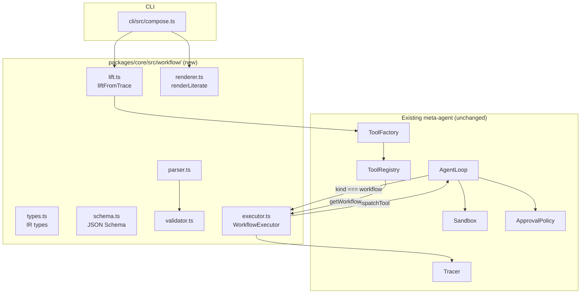

# Workflow IR — Design Spec

**Status:** Draft for implementation planning
**Date:** 2026-05-07
**Scope:** Formal symbolic IR for agent workflows, with composition and verification as design constraints. Implements the **LEAN** tier; sketches **COMPOSE** and **VERIFY** as follow-up specs.

---

## 1. Background and Motivation

This spec implements the ideas in two ACM articles by Erik Meijer:

- ["From Function Frustrations to Framework Flexibility"](https://queue.acm.org/detail.cfm?id=3722544) (Queue, April 2025) — adds a level of indirection between LLM-emitted tool calls and concrete values: every tool call's result is given a symbolic name (`@Sum`); the model reasons over names; the runtime substitutes values. This unlocks parameterization → reusable named "predicates" (composites).
- ["Guardians of the Agents"](https://cacm.acm.org/practice/guardians-of-the-agents/) (CACM, January 2026) — builds on the same primitive: the model emits a structured workflow up-front; the runtime applies a **generate → verify → execute** pipeline, so prompt-injected tool calls can be statically rejected by data-flow / source-sink analysis, security automata, and Z3-checked pre/post/frame conditions.

A reference implementation in Python exists at [`metareflection/guardians`](https://github.com/metareflection/guardians); its workflow shape (`Workflow{steps[]}` / `ToolCallNode` / `SymRef`) and its choice of a flat list with nested blocks (instead of the paper's graph-with-`next`-pointers AST) are both adopted here.

**The existing meta-agent today.** Composites are stored as TypeScript code that calls `invokeTool(name, args)`. The `/compose` REPL command takes a slice of successful tool calls and asks an LLM to write `tool.ts` (`createReactive`). The IR is missing entirely; the LLM's plan disappears the moment it gets compiled to TS.

**What this spec changes.** Introduces a formal `Workflow` IR as the persisted source of truth for new composites. Replaces `/compose`'s LLM-codegen path with a deterministic structural lift from observed traces. Designs the IR shape so future verification and richer composition plug in without breaking changes.

---

## 2. Goals and Non-Goals

### 2.1 Goals (LEAN, this spec)

1. **Formal symbolic IR** for agent workflows, with whole-value `SymRef` indirection and named result bindings.
2. **Pure-data validator** that catches malformed/ill-scoped IR before persistence and before execution.
3. **In-process executor** that runs an IR workflow against the existing tool dispatch, sandbox, and approval machinery.
4. **Deterministic lift-from-trace**: structurally convert an observed sequence of successful tool calls into IR, no LLM in the loop.
5. **Literate renderer**: project a workflow into a paragraph form with `@name` substitution (per Article 1's literate display style), used at compose-confirmation and post-execution display.
6. **Forward-compatible seams** so COMPOSE and VERIFY can land without IR-shape changes.

### 2.2 Non-Goals (deferred to follow-up specs)

- LLM-emitted IR (a `propose_workflow` meta-tool) — deferred to **COMPOSE**.
- Workflow-calls-workflow with formal parameters and an inliner — deferred to **COMPOSE**.
- Branching, loops, JSONPath in `SymRef` — deferred to tier B/C extensions.
- Any verifier check beyond well-formedness/scope/uniqueness — deferred to **VERIFY**.
- Streaming partial results, step-level retry/saga, parallel step execution.

### 2.3 Tiered IR roadmap

The IR ships as **tier A** with explicit reservations for B and C so each evolution is additive:

| Tier | Adds | Status in this spec |
|---|---|---|
| **A — Linear** | Ordered list of `tool_call` steps with named result bindings; whole-value `SymRef`s. | **Implemented.** |
| **B — Structured** | `branch` step kind; `SymRef.path` for sub-value access. | Typed-but-rejected; deferred. |
| **C — Programs** | `loop` step kind; tool `pre/post/frame` conditions evaluated by Z3. | Typed-but-rejected; deferred. |

---

## 3. Architecture



**Key insight.** A workflow tool has **no executable code of its own** — only data. The executor runs in-process; each step's underlying tool call flows through the existing `AgentLoop.dispatchTool`, which already handles approval, sandboxing, and recursion-depth limits. Permissions, approval gates, and tracing all reuse existing machinery.

A workflow becomes a registry-first-class third tool kind alongside `atomic` and the legacy TS-coded `composite`. Persistence layout for a workflow tool:

```
./tools/<name>/
  manifest.json
  workflow.json
  approval.json
```

(no `tool.ts`; that file is what makes it a workflow rather than a composite).

---

## 4. IR Shape

### 4.1 TypeScript types

```typescript
export const IR_SCHEMA_VERSION = 1 as const;

export const STEP_KIND = {
  tool_call: "tool_call",
  // Reserved for tier B (parser rejects in v1):
  branch:    "branch",
  // Reserved for tier C (parser rejects in v1):
  loop:      "loop",
} as const;
export type StepKind = (typeof STEP_KIND)[keyof typeof STEP_KIND];

export const ARG_KIND = {
  literal: "literal",
  symref:  "symref",
} as const;
export type ArgKind = (typeof ARG_KIND)[keyof typeof ARG_KIND];

export type Literal = {
  kind: typeof ARG_KIND.literal;
  value: unknown;                 // any JSON value
};

export type SymRef = {
  kind: typeof ARG_KIND.symref;
  ref: string;                    // name of an in-scope binding
  // Reserved for tier B (parser rejects non-undefined `path` in v1):
  // path?: string;
};

export type Argument = Literal | SymRef;

export type ToolCallStep = {
  kind: typeof STEP_KIND.tool_call;
  label: string;                  // unique within workflow
  tool: string;                   // name of a registered tool (any kind)
  arguments: Record<string, Argument>;
  resultBinding: string | null;   // null = result not used downstream
};

export type Step = ToolCallStep;  // tier B widens this union

export type WorkflowReturn = { source: SymRef } | null;

export type Workflow = {
  schemaVersion: typeof IR_SCHEMA_VERSION;
  name: string;                   // matches the registry tool name
  description: string;
  goal: string;                   // free-text user/agent intent at compose time
  inputs: string[];               // declared inputs in scope at start; v1 MUST be []
  steps: Step[];
  return: WorkflowReturn;
};
```

### 4.2 Two design notes

1. **`Argument` is a tagged union, not `string | unknown`.** The Python reference distinguishes `SymRef` from a literal by checking for a `"ref"` key, which is brittle when literals are themselves objects. We discriminate on `kind`, so a literal `{ ref: "foo" }` is unambiguous.
2. **`tool: string` (callee opaque to its kind).** v1 treats workflow tools as just-another-registry-tool; the executor doesn't encode callee kind. This is what makes COMPOSE non-breaking: when COMPOSE adds workflow-calls-workflow, the IR shape doesn't change at all — only the executor learns to handle a callee whose registry kind is `"workflow"`.

### 4.3 Reserved-future fields on `ToolManifest`

Added now, ignored in v1, used by VERIFY later:

```typescript
export type ToolManifest = {
  // ... existing fields unchanged ...
  kind: "atomic" | "composite" | "workflow";   // "workflow" added in this spec

  // Reserved for the VERIFY spec (all optional, ignored in v1):
  sourceLabels?: string[];        // taint labels this tool produces
  sinkParams?: string[];          // parameter names that are taint sinks
  preconditions?: string[];       // Z3-translatable expressions
  postconditions?: string[];
  frameConditions?: string[];
};
```

### 4.4 Persisted form

`workflow.json` is JSON, validated against a strict JSON Schema at parse time. Example for the running paper scenario:

```json
{
  "schemaVersion": 1,
  "name": "fetch-and-summarize-emails",
  "description": "Fetches the user's emails and produces a summary.",
  "goal": "summarize my inbox",
  "inputs": [],
  "steps": [
    {
      "kind": "tool_call",
      "label": "fetch",
      "tool": "fetch-mail",
      "arguments": { "folder": { "kind": "literal", "value": "inbox" } },
      "resultBinding": "emails"
    },
    {
      "kind": "tool_call",
      "label": "summarize",
      "tool": "summarize-list",
      "arguments": { "items": { "kind": "symref", "ref": "emails" } },
      "resultBinding": "summary"
    }
  ],
  "return": { "source": { "kind": "symref", "ref": "summary" } }
}
```

---

## 5. Validator

The validator is a pure function `validate(workflow, registry) → ValidationResult`. No I/O, no LLM, no execution. Runs at three points: when persisting (`factory.createWorkflow`), when loading from disk (`FsToolRegistry.get`), and at the start of `WorkflowExecutor.run` (defense-in-depth).

### 5.1 Checks

| # | Check | Error code |
|---|---|---|
| 1 | `schemaVersion === 1` | `unsupported_schema_version` |
| 2 | `inputs.length === 0` (v1 only; tier B widens) | `inputs_not_supported_in_v1` |
| 3 | Every step has `kind === "tool_call"` (branch/loop typed-but-rejected) | `step_kind_not_supported_in_v1` |
| 4 | `step.label` is unique within the workflow | `duplicate_step_label` |
| 5 | `step.resultBinding` is unique across the workflow (where non-null) and matches `/^[a-z_][a-z0-9_]*$/i` | `duplicate_binding` / `invalid_binding_name` |
| 6 | `step.tool` exists in the registry | `unknown_tool` |
| 7 | `step.tool` is **not** a meta-tool name (`find_tool`, `invoke_tool`, etc.) | `meta_tool_not_callable_from_workflow` |
| 8 | For every `SymRef.ref` in `step.arguments`: the `ref` is bound by an earlier step's `resultBinding` (no inputs in v1) | `unbound_symref` |
| 9 | For every `SymRef`: `path` is `undefined` (reserved for tier B) | `symref_path_not_supported_in_v1` |
| 10 | Argument set per step satisfies the callee's `inputSchema` at the **key level** — every required key present, no unknown keys when `additionalProperties: false`. (Value-level type-checking is intentionally NOT done; SymRef values are unknown statically.) | `missing_required_arg` / `unknown_arg` |
| 11 | `return.source.ref` (when non-null) is in scope at the end | `unbound_return` |

The IR is **acyclic by construction** — steps are an ordered list and refs only point backwards. No cycle check is needed; this is documented as an invariant.

### 5.2 ValidationResult shape

```typescript
export type ValidationError = {
  code: string;                   // one of the codes above
  message: string;                // human-readable
  stepLabel?: string;             // when applicable
  pointer?: string;               // JSONPath-ish, e.g. "/steps/2/arguments/items"
};

export type ValidationResult =
  | { ok: true }
  | { ok: false; errors: ValidationError[] };
```

### 5.3 Why no value-level type-checking

Whole-value `SymRef`s reference whatever the callee tool returned, and tool output shapes today are weakly typed (`outputShape: Record<string, unknown>` is rarely strict). Pretending we can verify shape compatibility statically would be a footgun. Tier B (when `SymRef.path` arrives) gets a real type-flow check; v1 keeps the contract narrow.

---

## 6. Executor

### 6.1 Interface

```typescript
export type DispatchTool = (
  name: string,
  args: unknown,
  depth: number,
) => Promise<ToolResult>;

export class WorkflowExecutor {
  constructor(opts: { tracer: Tracer });

  async run(
    workflow: Workflow,
    runtimeInputs: Record<string, unknown>, // values for workflow.inputs[]; v1: must be {}
    dispatchTool: DispatchTool,
    depth: number,
  ): Promise<ToolResult>;
}
```

### 6.2 Algorithm

1. Re-validate the workflow against the registry (defense-in-depth). On failure, return `{ ok: false, error: { kind: "schema_violation", details: { errors: [...] } } }`.
2. Initialize `env = new Map<string, unknown>()`.
3. Trace `workflow_start { name, depth }`.
4. For each step in order:
   1. Resolve arguments: literal → `value`; symref → `env.get(ref)`. If a SymRef points to an unbound name, return `{ ok: false, error: { kind: "schema_violation", details: { code: "unbound_symref_runtime" } } }` (validator should prevent this; this is defense-in-depth).
   2. Trace `workflow_step_start { name, label, tool }`.
   3. `result = await dispatchTool(step.tool, resolvedArgs, depth + 1)`.
   4. Trace `workflow_step_end { name, label, tool, ok, durationMs }`.
   5. If `!result.ok`, **fail-fast**: return the inner error wrapped with `details: { workflow: name, failedStep: step.label }`.
   6. If `step.resultBinding !== null`, `env.set(step.resultBinding, result.value)`.
5. Trace `workflow_end { name, ok: true, durationMs }`.
6. If `workflow.return === null`, return `{ ok: true, value: null }`.
7. Otherwise return `{ ok: true, value: env.get(workflow.return.source.ref) }`.

### 6.3 Wiring into `AgentLoop.dispatchTool`

`AgentLoop` gains a `WorkflowExecutor` instance (constructed once with `opts.tracer`). The executor is invoked via a single new branch in `dispatchTool`, just after the registry lookup:

```typescript
if (tool.manifest.kind === TOOL_KIND.workflow) {
  const wf = await this.opts.registry.getWorkflow(tool.manifest.name);
  return this.executor.run(wf, input as Record<string, unknown>, this.dispatchTool.bind(this), depth);
}
```

In v1, `input` is forwarded as `runtimeInputs` to `WorkflowExecutor.run`; the validator already enforces that the workflow declares no `inputs[]`, so the executor will treat any non-empty `runtimeInputs` as a contract violation (`inputs_not_supported_in_v1`).

### 6.4 Semantic guarantees (v1)

- **Sequential, fail-fast.** No parallelism, no try/catch around steps. (Tier B may relax.)
- **Whole-result binding.** A step's `resultBinding` captures the entire return value. Sub-value access reserved for tier B.
- **Immutable env.** Once bound, a name is never re-assigned (validator already enforces uniqueness; the executor never mutates).

### 6.5 Trace events

Added to the existing `tracer.ts`: `workflow_start`, `workflow_step_start`, `workflow_step_end`, `workflow_end`. The pre-existing `tool-call` event gains an optional `parentWorkflow?: { name: string; stepLabel: string }` so step calls remain attributable inside the existing log shape.

---

## 7. Lift-from-Trace

### 7.1 What it does

Mechanically converts an *already-observed* sequence of successful tool invocations (a runtime trace, with concrete values flying around) into an abstract `Workflow` IR (named bindings + `SymRef`s, no LLM in the loop). The term is borrowed from compilers — we hoist concrete data up to a symbolic level. Same trace ⇒ byte-identical IR.

### 7.2 Algorithm

```
Input: ordered list of { name, args, ok, value } from the live session.

1. Filter to ok-only invocations.
2. For each i, allocate:
   - label_i   = "step_<i>_<sanitize(name)>"
   - binding_i = "r_<i>_<sanitize(name)>"
   where sanitize replaces non [a-z0-9_-] with '_'.
3. Build bindingByValue: Map<canonicalJson(value), binding>.
   - Insert each step's value AFTER its step is constructed.
   - Earliest-wins: if the same canonical value was already produced, do not overwrite.
4. For each invocation's arguments map { k -> v }:
   - Hit  on canonicalJson(v) in bindingByValue → SymRef{ ref }.
   - Miss → Literal{ value: v }.
   - Top-level only (sub-value access reserved for tier B).
5. workflow.return = the last step's resultBinding wrapped in SymRef, or null.
6. Manifest derivation:
   - kind:         "workflow"
   - permissions:  union of step tools' permissions (reuse permissions-normalize.ts)
   - dependencies: distinct set of step.tool names
   - inputSchema:  {}    (v1; COMPOSE adds formal parameters)
   - outputShape:  {}    (v1; could later inherit from last step)
   - hash:         hash(canonicalJson(workflow) + canonicalJson(manifest))
7. Run validate(workflow, registry). If errors, lift fails with structured errors.
```

### 7.3 Worked example

Three successful tool calls in a session:

```
[1] read-csv      args={path:"/x.csv"}                      value={rows:[{a:1,b:2},{a:3,b:4}]}
[2] filter-rows   args={rows:[{a:1,b:2},{a:3,b:4}],         value={rows:[{a:3,b:4}]}
                       predicate:"a > 1"}
[3] count-rows    args={rows:[{a:3,b:4}]}                   value={count:1}
```

User runs `/compose 1-3`, names it `filter-and-count`. Lifting produces:

```json
{
  "schemaVersion": 1,
  "name": "filter-and-count",
  "inputs": [],
  "steps": [
    { "kind": "tool_call", "label": "step_0_read-csv", "tool": "read-csv",
      "arguments": { "path": { "kind": "literal", "value": "/x.csv" } },
      "resultBinding": "r_0_read_csv" },
    { "kind": "tool_call", "label": "step_1_filter-rows", "tool": "filter-rows",
      "arguments": {
        "rows":      { "kind": "symref",  "ref": "r_0_read_csv" },
        "predicate": { "kind": "literal", "value": "a > 1" }
      },
      "resultBinding": "r_1_filter_rows" },
    { "kind": "tool_call", "label": "step_2_count-rows", "tool": "count-rows",
      "arguments": { "rows": { "kind": "symref", "ref": "r_1_filter_rows" } },
      "resultBinding": "r_2_count_rows" }
  ],
  "return": { "source": { "kind": "symref", "ref": "r_2_count_rows" } }
}
```

Step 2's `args.rows` matches step 1's `value` byte-for-byte ⇒ rewritten to `SymRef{ref:"r_0_read_csv"}`. Step 2's `args.predicate` was never produced by any prior step ⇒ kept as `Literal`. Same for step 3.

### 7.4 UX gotcha worth surfacing

Because structural matching is **top-level only**, if the LLM passed `{ to: priorEmail.from }` (sub-value access), the lift produces a literal — the workflow won't generalize. The new `/compose` flow shows the lifted IR (canonical JSON + literate render) **and** lists every argument that became a literal so the user can decide whether the lift is faithful before persisting.

---

## 8. Literate Renderer

### 8.1 Function signature

```typescript
export function renderLiterate(
  workflow: Workflow,
  env?: ReadonlyMap<string, unknown>,
): string;
```

### 8.2 Behavior

- **Without `env`** (used pre-persistence at `/compose` confirmation): renders raw `@names`, e.g.

  ```
  Workflow: filter-and-count
    @r_0_read_csv  ← read-csv(path="/x.csv")
    @r_1_filter_rows ← filter-rows(rows=@r_0_read_csv, predicate="a > 1")
    @r_2_count_rows ← count-rows(rows=@r_1_filter_rows)
  Return: @r_2_count_rows
  ```

- **With `env`** (used post-execution to give the user a substituted view): inlines `@name=value` notation per Article 1, e.g.

  ```
    @r_2_count_rows = {"count":1} ← count-rows(rows=@r_1_filter_rows={"rows":[…]})
  ```

- **Deterministic.** Same workflow + same env → same string.

### 8.3 Where it's called

- `cli/src/compose.ts` — between lift and persistence, to confirm the IR with the user. Listed alongside the args-that-became-literals report from §7.4.
- `agent-loop.ts` — after a successful workflow tool execution, optional one-line summary in the trace stream.

---

## 9. Module / File Layout

### 9.1 New module

```
packages/core/src/workflow/
  types.ts        # IR types
  schema.ts       # JSON Schema for the IR (used by parser)
  parser.ts       # parseWorkflow(json): Workflow | ValidationError[]
  validator.ts    # validate(workflow, registry): ValidationResult
  executor.ts     # WorkflowExecutor
  lift.ts         # liftFromTrace(slice, opts): { workflow, manifest } | LiftError
  renderer.ts     # renderLiterate(workflow, env?): string
  index.ts        # public exports
```

### 9.2 Touch sites

- `packages/core/src/types.ts` — add `workflow` to `TOOL_KIND`; add reserved verify fields to `ToolManifest`.
- `packages/core/src/registry/fs-registry.ts` — load `workflow.json` for `kind: "workflow"`; new `getWorkflow(name): Promise<Workflow>` method.
- `packages/core/src/agent/agent-loop.ts` — hold a `WorkflowExecutor` instance; branch on `kind === "workflow"` in `dispatchTool`; extend `ToolInvokedEvent` with `value: unknown` (and `error`).
- `packages/core/src/factory/factory.ts` — new `createWorkflow({slice, name, intent, description})`; **remove** `createReactive` (CLI is the sole caller; no deprecation period).
- `packages/core/src/tracer.ts` — new event kinds `workflow_start`, `workflow_step_start`, `workflow_step_end`, `workflow_end`; optional `parentWorkflow` on `tool-call`.
- `packages/cli/src/compose.ts` — collect `value` per `InvocationRecord`; call `factory.createWorkflow`; render the lifted IR for confirmation; show literal-fallback list.

---

## 10. Test Plan

`node:test`, matching the existing style in `factory.test.ts`.

- `parser.test.ts` — strict JSON Schema rejects malformed inputs (extra keys, wrong kinds, unknown step kinds).
- `validator.test.ts` — every error code in §5.1 has a positive and a negative case.
- `executor.test.ts` — happy path; whole-value `SymRef` resolution; fail-fast on step error; null return; non-null return; runtime unbound-symref defense.
- `lift.test.ts` — structural matching; sub-value falls back to literal; earliest-wins on duplicate values; deterministic byte-identical output; permission union.
- `renderer.test.ts` — env-less render shows `@names`; env render substitutes; deterministic; round-trips a hand-built workflow.
- `factory.test.ts` — new `createWorkflow` path; existing tests unchanged.
- `e2e.test.ts` — round-trip: invoke 2–3 atomic tools live → lift slice → validate → execute the lifted workflow → confirm parity with the original outputs.

---

## 11. Rollout

Small commits, all green at each step:

1. Land `workflow/` module with parser/validator/executor/renderer; pure unit tests; no consumers yet.
2. Extend `TOOL_KIND`, `ToolManifest`, registry to load `workflow.json`.
3. Add `agent-loop.ts` branch for `kind === "workflow"`; tracer events.
4. Add `factory.createWorkflow`; remove `createReactive`.
5. Switch `cli/src/compose.ts` to the new path; e2e test.

---

## 12. Risks and Open Questions

1. **Earliest-wins SymRef collision rule** is a deliberate simplification. If two unrelated tools happen to return the same canonical JSON (e.g., both produce `{}`), the second call's args will be rewritten to point at the first. Mitigation: surface the literal-fallback list in `/compose`; users see exactly which substitutions happened.
2. **No formal output type for workflows** in v1 (`outputShape: {}`). Composites of workflows that depend on output shape will be coarse until COMPOSE lands.
3. **Trace event volume.** Every step adds two trace events; long workflows trace heavily. Acceptable for v1; revisit if it shows up in observed sessions.
4. **Permission union may over-approximate.** A workflow that conditionally needs network access (in a branch tier B might add) currently always declares it. Re-examine when tier B lands.

---

## 13. COMPOSE — Follow-Up Spec Sketch

Builds **only** on v1 LEAN seams; **no IR-shape changes**.

- `Workflow.inputs[]` becomes a real list of typed parameter names (v1 already typed it; v1 just rejects non-empty).
- A workflow tool's `inputSchema` is derived from `inputs[]` (no longer `{}`).
- Workflow can call another workflow with no IR change — `tool: string` is opaque to callee kind. Executor needs no change either; the dispatch already works via `AgentLoop.dispatchTool`.
- New: an inliner pass (scope-renaming) for verification/optimization.
- New: an LLM-authored path — a `propose_workflow` meta-tool that emits IR end-to-end. Until COMPOSE, IR is only produced by lifting.
- v1 seams used: `Workflow.inputs[]` already typed; tier-B `STEP_KIND.branch` stays rejected (COMPOSE does not unblock branching; that is a separate tier-B move).

---

## 14. VERIFY — Follow-Up Spec Sketch

Builds **only** on v1 LEAN seams; **no IR-shape changes**.

- New `Policy` type: `{ allowedTools, taintRules, automata }`.
- New `verify(workflow, policy, registry) → VerificationResult` with three independent checkers, each rooted in a different reserved manifest field:
  - **Taint analysis** uses `sourceLabels` + `sinkParams` (reserved on `ToolManifest` in §4.3). Provenance-tracked label propagation, with sanitizers breaking the chain.
  - **Security automata** read `Policy.automata`; transitions evaluate against literal args at static time, conservatively assume unsafe for `SymRef` arguments.
  - **Z3 conditions** translate `preconditions`/`postconditions`/`frameConditions` (also reserved on `ToolManifest`) from a small DSL to Z3.
- Pipeline change: agent loop's workflow dispatch becomes `verify → (ok ? executor.run : reject)`, defaulting to `verifyFirst: true` (mirrors the metareflection reference).
- v1 seams used: all five reserved manifest fields; the executor's clean separation of "validate well-formedness" (in-IR, v1) from "verify policy" (out-of-IR, VERIFY).

---

## 15. References

- Erik Meijer, ["From Function Frustrations to Framework Flexibility"](https://queue.acm.org/detail.cfm?id=3722544), Queue, 2025.
- Erik Meijer, ["Guardians of the Agents"](https://cacm.acm.org/practice/guardians-of-the-agents/), CACM, 2026.
- [`metareflection/guardians`](https://github.com/metareflection/guardians) — Python reference implementation (~1900 LOC, 100 tests).
