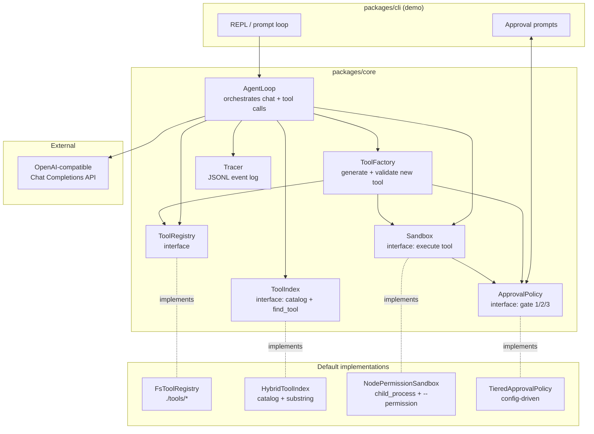
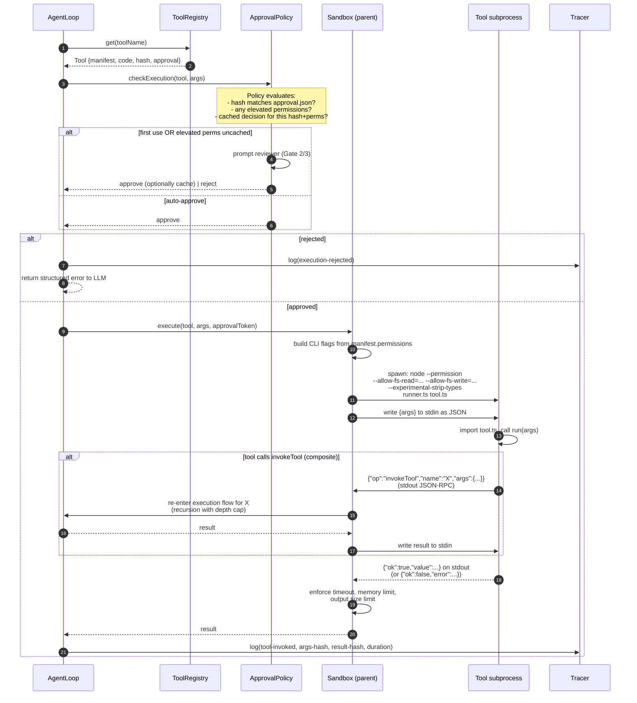
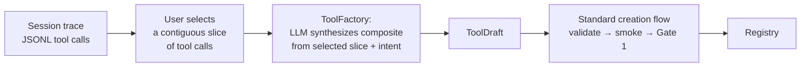

# Meta-Agent with Dynamic Tool Creation — Design Spec

**Status:** Draft for implementation planning
**Date:** 2026-04-21
**Scope:** POC of a meta-agent that dynamically creates, reuses, composes, and safely executes TypeScript tools on a local machine.

---

## 1. Goals and Non-Goals

### 1.1 Goals

1. **Dynamic tool creation.** An agent that recognizes when its current capabilities don't match the task, authors a new tool on the fly (generates code + schema + permission manifest), validates it, and uses it.
2. **Persistent, searchable tool registry.** Tools created by the agent are saved locally and reused across tasks and sessions. The agent looks before it builds.
3. **Safe-by-default execution.** Dynamically generated code runs under a real, OS-enforced permission boundary. A tiered human-in-the-loop (HITL) model gates creation and elevated executions.
4. **Tool composition.** The agent can author *composite tools* whose implementation calls other existing tools via an internal `invokeTool` API, both proactively (during planning) and reactively (by turning a successful session slice into a named reusable tool).
5. **Minimal external dependencies.** Rely on modern Node.js built-ins. No native addons, no framework SDKs.
6. **Abstracted seams.** Every interesting dimension — registry storage, tool lookup, sandbox mechanism, LLM provider, approval policy — sits behind a small interface so richer implementations can be swapped in later without touching call sites.

### 1.2 Non-goals (for this POC)

- Sub-agents / multi-agent orchestration.
- Remote or multi-machine tool registries.
- Automatic pattern mining across sessions to propose composites (noted as a future "self-evolving" capability).
- Semver-style tool versioning (we use code+manifest hash as version).
- Streaming tool output back to the LLM mid-execution.
- Shared state across tool invocations (each call is a fresh subprocess).

### 1.3 Runtime prerequisites

- **Node.js ≥ 22.6**, for two built-in capabilities we rely on:
  - `--permission` model (Node ≥ 20.0) for OS-enforced per-process permission boundaries.
  - `--experimental-strip-types` (Node ≥ 22.6) for running `.ts` source directly without a transpile step.
- **OpenAI-compatible Chat Completions endpoint** for the LLM. This keeps us provider-agnostic (OpenAI, any OpenAI-compatible gateway, local servers like Ollama behind an OpenAI shim, etc.).

---

## 2. Form of the Deliverable

An **embeddable core module plus a thin demo CLI**, organized as a small monorepo:

- `packages/core` — the meta-agent machinery. Zero TTY/CLI dependencies. Every side-effecting surface (filesystem, subprocess, human prompt, LLM) is behind an interface.
- `packages/cli` — a minimal REPL + approval TUI + `/compose` command that drives `core`. Exists to make the system end-to-end runnable and reviewable from day one.

This split is what makes the abstraction boundaries real: the `core` package cannot import from `cli`, so any coupling to terminal prompts, file layout, or interactive UX lives only in `cli`. A future web UI or IDE extension swaps in place of `cli` without touching `core`.

---

## 3. Architecture Overview

The system is structured around five clearly-bounded components inside `core`. Each has a small interface; the POC ships one default implementation per interface.



**Component responsibilities:**

- **`AgentLoop`** — owns the conversation state, assembles the tool catalog for the system prompt, calls the LLM, dispatches tool calls, logs events. Knows nothing about filesystems, subprocesses, or prompts — depends only on the five interfaces.
- **`ToolRegistry`** — CRUD over tools (load, save, delete, get by name, list, dependency lookup). Default = filesystem under `./tools/<name>/{tool.ts, manifest.json, approval.json}`.
- **`ToolIndex`** — answers "given a natural-language query, which existing tools are relevant?" Default = hybrid (always-on mini-catalog in prompt + `find_tool` meta-tool using substring/BM25-lite over manifest text). Embedding-based implementation pluggable behind the same interface (Section 10).
- **`Sandbox`** — given tool name, args, and manifest, runs the tool in a subprocess with Node `--permission` flags derived from the manifest; returns a structured `{ok, value} | {ok:false, error}`.
- **`ApprovalPolicy`** — single interface called at all three gates (creation, first execution, subsequent execution); tiered default policy decides whether to prompt, auto-approve, or auto-deny based on permission risk level and cached prior decisions keyed by code+manifest hash.
- **`ToolFactory`** — the workflow that turns a "tool gap" signal into an approved tool in the registry: LLM code-gen → static validation → sandboxed smoke test → Gate 1 approval → registry write. Used for both greenfield tools and composite tools.
- **`Tracer`** — append-only JSONL log of every LLM turn, tool call, approval decision, and creation event.

**Why these specific seams:** each interface corresponds to a dimension likely to evolve independently. You can swap the registry for SQLite without touching anything else; swap the index for embeddings without touching the sandbox; swap the approval policy for a web UI without touching the agent loop. The seams are chosen so that *changes* stay local.

---

## 4. Tool Lifecycle — Creation Flow (Gate 1)

This is the path from "the agent notices it lacks a capability" to "a new tool is sitting in the registry, approved and ready to use." It applies to both greenfield tools and composite tools; composites differ only in what the generated code looks like and that their manifest has `dependencies`.

```mermaid
sequenceDiagram
    autonumber
    participant A as AgentLoop
    participant F as ToolFactory
    participant L as LLM
    participant S as Sandbox
    participant P as ApprovalPolicy (Gate 1)
    participant R as ToolRegistry
    participant T as Tracer

    A->>A: Decide "no existing tool fits;<br/>need to author one"
    A->>F: requestNewTool({intent, context, existingToolsConsidered})
    F->>L: generate(tool-authoring prompt)
    L-->>F: ToolDraft {name, description, inputSchema,<br/>permissions, code, smokeTestInput, rationale}
    F->>F: Static validation<br/>(schema parses, name unique,<br/>imports allowlisted,<br/>permissions well-formed)
    alt validation fails
        F->>L: re-generate with error feedback<br/>(bounded retries, default 2)
    end
    F->>S: smoke-test run (sandboxed, using draft's<br/>own declared permissions)
    S-->>F: {ok, value} or {ok:false, error}
    alt smoke-test fails
        F->>L: repair-loop with error output<br/>(bounded retries)
    end
    F->>P: review(ToolDraft, smokeTestResult)
    P-->>F: approve | approve-with-edits | reject
    alt approved
        F->>R: save(tool)
        F->>T: log(tool-created)
        F-->>A: ToolRef
    else rejected
        F->>T: log(tool-rejected, reason)
        F-->>A: error("rejected by reviewer: <reason>")
    end
```

### 4.1 Triggering

The agent decides to author a tool by emitting a special meta-tool call `propose_new_tool({intent, rationale})`. This is one of a small set of **always-available meta-tools** in the system prompt (alongside `find_tool`, `invoke_tool`, `list_tools`, `propose_composite_tool`, `save_sequence_as_tool`, `stop`).

*Why an explicit tool call and not inferred from free-text:* making creation a structured meta-tool call keeps the control flow auditable, makes the trace log clean, and lets the factory mechanically validate and retry without parsing English.

### 4.2 `ToolDraft` shape

What the LLM must emit as structured output from the `propose_new_tool` call:

| Field | Purpose |
|---|---|
| `name` (kebab-case, unique) | Stable identifier. |
| `description` | One-sentence capability summary; also used by `ToolIndex` for search. |
| `inputSchema` (JSON Schema) | The contract callers must satisfy. |
| `outputShape` (JSON Schema) | Return-value contract; keeps composites type-aware. |
| `permissions` | Declarative manifest: `fsRead: string[]`, `fsWrite: string[]`, `net: 'none' \| 'allowlist'`, `netAllowlist: string[]`, `env: string[]`. Defaults = deny-all. |
| `code` | Full contents of `tool.ts`. Must export `run(input)`. |
| `dependencies` (composites only) | Names of tools this one calls via `invokeTool`. |
| `smokeTestInput` | A concrete input example the LLM believes is valid. |
| `rationale` | Why this tool is needed; shown to the reviewer at Gate 1. |

### 4.3 Static validation (pre-smoke-test, cheap checks)

Runs before we spend a sandbox invocation:

- Name uniqueness vs. existing tools and tombstones.
- Input and output schemas parse as valid JSON Schema.
- Permissions manifest is well-formed.
- No obviously-disallowed imports (bare `child_process`, `fs/promises` when no fs permissions requested, network modules when `net: 'none'`).
- For composites: declared `dependencies` exactly matches the set of tool names appearing in `invokeTool(...)` call sites (parsed from the source).

Validation failures feed back into a **bounded repair loop** (default 2 retries) with the error as feedback to the LLM. This dramatically improves first-pass success without human intervention.

### 4.4 Smoke test (pre-Gate-1)

Before the human sees anything, we run the draft in the real sandbox with its own declared permissions against `smokeTestInput`. This catches:

- Syntactic/runtime failures missed by static checks.
- **Declared-permission mismatches** — tool says it doesn't need net but tries to `fetch`. This is the single highest-value security check: it aligns the *declared* permissions with the *actual* behavior before any human trusts either.

If the sandbox denies a permission the tool needed, we prompt the LLM either to declare the missing permission (and re-review) or to rewrite without the dependency.

### 4.5 Gate 1 approval payload

What the reviewer sees:

- Name, description, rationale.
- Full input and output schemas.
- **Permission manifest with elevated items highlighted** (network, fs-writes outside workspace, env reads).
- Full code (syntax-highlighted in the CLI).
- Smoke test input and its output.
- For composites: dependency list + the **bubbled-up effective permission set** (declared ∪ union-of-dependency-permissions).
- Actions: **approve** / **reject** / **edit-and-approve** (drops into `$EDITOR` on the draft; edited version is re-validated and re-smoke-tested before acceptance).

### 4.6 Approval caching key

`sha256(code || canonicalJson(manifest))`. Any change to either invalidates prior approval, which causes re-prompting at Gate 2/3 and at every future execution until re-approved.

### 4.7 On-disk result

A successful creation writes three files under `./tools/<name>/`:

```
tools/
  <name>/
    tool.ts         # executable code
    manifest.json   # schemas, permissions, deps, hash, created-at, rationale
    approval.json   # who approved, when, which hash, any edits applied
```

### 4.8 Why this shape

- Emitting a `ToolDraft` as a **structured meta-tool call** (not free-form chat) means validation and retry are mechanical, and the trace log is clean.
- The **repair loop before human review** keeps the reviewer's attention for semantic judgment, not syntactic babysitting.
- **Smoke-testing with the tool's own declared permissions** aligns declaration with reality before any human trusts either. It is the highest-leverage automated security check in the system.
- Storing `approval.json` alongside the tool keeps approval state **inspectable and grep-able** and makes the system behave correctly across restarts.

---

## 5. Execution Flow (Gates 2 and 3, Sandbox Protocol)

Every time the agent calls an existing tool, this path runs.



### 5.1 Sandbox invocation details

**Command shape.** The parent spawns, argv-based (no shell):

```
node --permission \
     --allow-fs-read=<workspace>,<tool-dir>,<manifest.fsRead...> \
     --allow-fs-write=<manifest.fsWrite...> \
     [--allow-net if manifest.net !== 'none'] \
     --experimental-strip-types \
     --no-addons \
     <runner.ts> <tool.ts>
```

The runner is a tiny bootstrap shipped with `core` that:

1. Imports the tool's `run()` export.
2. Reads JSON args from stdin.
3. Calls `run(args)`.
4. Writes the JSON result to stdout.
5. Handles `invokeTool` JSON-RPC messages for composites (see 5.3).

**Per-invocation hard limits** enforced by the *parent*, not trusted to the child:

- Wall-clock timeout (default 30s; per-tool override in manifest).
- Max stdout/stderr bytes (default 1 MiB; truncated with marker, returned as `output_truncated` error if exceeded).
- Subprocess killed on limit breach; the agent receives a structured error.
- Memory cap via `--max-old-space-size` from the manifest.

### 5.2 Network scoping

Node's `--allow-net` is coarse (on/off). For host-level allowlisting in v1 we rely on a **thin shim** that the runner installs before importing the tool: it monkey-patches `fetch`, `undici`, and `http.request` to reject hosts not in `manifest.netAllowlist`.

This is belt-and-suspenders — the declared intent is checked at the application layer even though the OS layer is only on/off. *A determined adversarial child could work around the shim.* For the POC the combination of per-tool `--allow-net` declaration (so a non-network tool has no network at all) plus HITL approval of the code is the real guard. A true host-level network jail (e.g., a proxy subprocess) is noted as future hardening (Section 10).

### 5.3 `invokeTool` protocol for composites

The runner exposes `invokeTool(name, args)` to the tool code. It serializes a JSON-RPC request over stdout, the parent pauses the child, recurses into the standard execution flow for the named dependency, then writes the result back over the child's stdin.

Two invariants:

- **Every nested call goes through `ApprovalPolicy` independently.** No ambient authority inheritance.
- **Depth cap (default 8)** prevents runaway recursion.

The first invariant is the single most important security property for composition: a "reader" tool cannot be wrapped by a "writer" composite to gain write permissions, because each leaf is checked on its own merits.

### 5.4 Policy decisions (`ApprovalPolicy.checkExecution`)

Given a tool `T` with hash `h` and permissions `p`:

1. If `approval.json` shows `h` approved with the same `p` *and* the reviewer previously selected "always approve for this tool" → **auto-approve** (Gate 3 fast path).
2. Else, compute **risk tier** from `p`:
   - **low** — reads within workspace only; no writes; no net; no env.
   - **medium** — writes within workspace; no net; env reads of non-sensitive-named vars.
   - **elevated** — any net, any fs outside workspace, any env containing `TOKEN|KEY|SECRET|PASS` patterns.
3. **low** → auto-approve, log only.
4. **medium** → prompt once per session (or per hash), cache for the session.
5. **elevated** → prompt every time *unless* the reviewer explicitly chose "always allow" at Gate 1.
6. In `--yolo` mode, steps 2–5 collapse to "auto-approve, log everything" — the sandbox permissions are the only guard.

### 5.5 Result shape returned to the LLM

Everything is a structured tool result; no exceptions bubble through the agent loop:

```json
{ "ok": true,  "value": <any-JSON> }
{ "ok": false, "error": { "kind": "timeout" | "permission_denied" | "runtime_error" | "rejected_by_user" | "schema_violation", "message": "...", "details": {...} } }
```

This gives the agent a uniform way to reason about failures and decide whether to retry, adapt inputs, or ask for a new/modified tool.

### 5.6 Why these shapes

- The **approval token** threaded from `ApprovalPolicy` into `Sandbox.execute` prevents an implementation bug where the sandbox "forgets" to consult policy — the sandbox signature *requires* the token, so policy is in the critical path by construction.
- **No ambient authority on composite calls** (every nested `invokeTool` re-enters policy) means composites cannot launder permissions.
- **Structured error results, not thrown exceptions** crossing the sandbox boundary keeps the LLM's mental model simple and the trace log clean.

### 5.7 Known trade-offs

- **Subprocess spawn cost is ~20–80ms** per tool call. Acceptable for a POC; visible in multi-tool chains. Noted as future optimization (warm worker pool per tool, reset state between uses).
- **The fetch/undici monkey-patch for net allowlisting is a soft boundary.** The coarse `--allow-net` plus HITL is the hard guard; the shim is a declared-intent check at the app layer.

---

## 6. Tool Registry and Lookup (Hybrid Index)

Goal: the agent prefers reusing tools over creating new ones, with minimal prompt overhead.

### 6.1 `ToolRegistry` interface

```ts
interface ToolRegistry {
  list(): Promise<ToolSummary[]>;              // name, description, hash
  get(name: string): Promise<Tool | null>;     // full manifest + code
  save(tool: Tool, approval: ApprovalRecord): Promise<void>;
  delete(name: string, opts: { cascade?: boolean }): Promise<void>;
  getDependents(name: string): Promise<string[]>; // who imports me (composites)
  subscribe(listener: (ev: RegistryEvent) => void): Unsubscribe;
}
```

The default `FsToolRegistry` maintains an in-memory cache built from one pass over `./tools/*/manifest.json` at startup and kept live via `fs.watch`. Dependency edges are extracted from each manifest's `dependencies` field and indexed for `getDependents`.

### 6.2 `ToolIndex` interface

```ts
interface ToolIndex {
  catalog(opts?: { maxEntries?: number }): CatalogEntry[];
  // Cheap, synchronous; returns {name, oneLineDescription} for prompt injection.

  find(query: string, opts?: { k?: number }): Promise<FindResult[]>;
  // Returns ranked matches with {name, description, score, matchSpans}.
}
```

### 6.3 How the hybrid works — two cooperating layers

**Layer 1 — Always-on mini-catalog in the system prompt.** Every agent turn, `AgentLoop` injects the output of `catalog()` into the system prompt as a compact block:

```
## Available tools (<N>)
- web-fetch: Fetches a URL and returns the body as text.
- csv-parse: Parses a CSV string into rows of objects.
- ...
Use `find_tool(query)` to search in detail if you don't see what you need.
```

This layer is free (no API calls), always current, and handles the common case. When the catalog grows past a threshold (default 40 entries), the agent loop elides older/lower-priority entries and relies on Layer 2.

**Layer 2 — Explicit `find_tool` meta-tool:**

```ts
find_tool(query: string, k?: number = 5) -> Array<{
  name: string;
  description: string;
  inputSchema: JSONSchema;
  score: number;
  matchSpans: string[];
}>
```

The v1 implementation is a small ranker over `name + description + rationale + inputSchema.properties.*.description`:

- Tokenize query and each tool's searchable text.
- Score: weighted sum of exact-name match (×4), exact-phrase match in description (×2), token overlap (normalized), and BM25-lite (IDF × TF with a small constant). No external deps.
- Return top-k with scores and match spans.

This gives "good enough" matching for a POC and, critically, establishes the interface contract (`find(query) → ranked results`) that an embedding-based implementation can satisfy identically later.

### 6.4 When `find_tool` runs vs. direct selection from catalog

The system prompt includes a simple rubric:

> - If one or two catalog entries clearly match the task, call them directly via `invoke_tool`.
> - If nothing in the catalog seems to fit, call `find_tool` to search for variants you may have missed.
> - If `find_tool` returns nothing with a score above the threshold, consider `propose_new_tool`.

The only **mechanical enforcement**: before `propose_new_tool` is accepted, the agent must have called `find_tool` at least once for the current task (enforced in `ToolFactory.requestNewTool`). Everything else is guidance, because over-mechanizing decimates agent flexibility without catching meaningful failure modes.

### 6.5 Catalog rendering details

- Entries sorted by: recency of successful use > creation time.
- Each entry rendered as `<name>: <first sentence of description, ≤80 chars>`.
- Composite tools marked with a leading `∘` glyph so the LLM can recognize them as cheap-to-reuse compositions.
- Deprecated/rejected tool names kept in `.tombstones.json` so the LLM won't re-propose them by name in the same session.

### 6.6 Why this shape

- **Two layers with the same interface** means we can dial the split (in-prompt catalog vs. lookup) without changing call sites — it's a single config value.
- **Forcing at least one `find_tool` call before `propose_new_tool`** is the one mechanical dedup guard worth having; everything else is guidance.
- **Per-tool hash in the vector file** (future embedding index) means we don't re-embed unchanged tools on startup.

---

## 7. Composition (Proactive + Reactive-Manual)

Two paths reach the same end state — a new composite tool in the registry.

### 7.1 Proactive composition (during planning)

Another meta-tool the agent can call:

```ts
propose_composite_tool({
  name: string,
  intent: string,
  plannedSteps: Array<{ tool: string; argsTemplate: string }>,
}) -> ToolRef
```

When the agent calls this, `ToolFactory` runs a specialized code-gen prompt: *"Given these existing tools and this intent, write a composite tool that implements the intent by calling them via `invokeTool`."* The resulting `ToolDraft` then passes through the **same creation flow** as any other tool (Section 4) — static validation, smoke test, Gate 1 approval. No custom path.

The only composite-specific bits:

- Manifest includes `dependencies: string[]` (derived by scanning `invokeTool(...)` call sites in the generated code; mismatch with the declared list fails static validation).
- Manifest's effective permission set is shown to the reviewer as `declared ∪ bubbled-up-from-deps`.
- The composite's own permissions field typically contains only what the composite itself uses *outside* of `invokeTool` calls — often empty.

*Why have `propose_composite_tool` at all vs. just letting the agent call `propose_new_tool` with composite code:* (1) it's a clearer signal for the agent's own planning — "this is a chaining problem, not a greenfield problem" — which the system prompt can lean on; (2) it lets us swap in a composite-specialized code-gen template that knows to write thin orchestration code, not re-implement the underlying tools.

### 7.2 Reactive-manual composition (at end of task)

Triggered two ways:

1. **User command** — in the demo CLI, typing `/compose` after a task ends opens the end-of-task flow.
2. **End-of-task prompt** (opt-in via config) — when the agent emits `stop`, the CLI asks: *"Save a sequence of the tools used as a new composite? [review / skip]"*

The flow:



What the user sees when `/compose` fires:

```
Tool calls in this session:
  [1] web-fetch({url: "..."})                      → 3.2s, 4.1kb
  [2] extract-json({text: "...", path: "$.items"}) → 80ms, 12 items
  [3] filter-by-field({items: [...], field: "..."}) → 20ms, 4 items
  [4] csv-stringify({rows: [...]})                  → 15ms

Select a contiguous slice to turn into a composite:
  > 1-4
Proposed name (leave blank to auto-generate):
  > fetch-and-extract-as-csv
Intent (1-2 sentences):
  > Given a URL and a JSONPath, fetches, extracts, filters, and serializes to CSV.
```

From there, `ToolFactory` receives the slice (with arg shapes and observed output shapes), synthesizes the composite code, derives an input schema from the *variable* parts of the original args (stable parts become defaults), runs the standard flow. The reviewer sees the generated composite at Gate 1 with the original session slice shown alongside as reference: *"this tool is meant to reproduce the marked slice."*

*Why manual selection and not automatic detection:* automatic "find repeated patterns" heuristics are brittle and miss the user's actual intent — two syntactically similar sequences may be conceptually different, and vice versa. Manual selection is a one-step interaction that yields a high-quality signal (user-confirmed intent + concrete example). Automatic pattern mining across sessions is deferred to future work (Section 10) as a "self-evolving agent" capability.

### 7.3 Composition safety invariants

Three properties the design enforces mechanically, not by convention:

1. **No ambient authority.** Every `invokeTool(name, args)` call from inside a composite re-enters `ApprovalPolicy.checkExecution`. A composite cannot grant its dependencies permissions they don't have.
2. **Declared dependencies must match actual calls.** Static validation parses the generated code's `invokeTool(...)` call sites and fails the draft if the set differs from `manifest.dependencies`. This prevents "silent" dependencies.
3. **Dependency existence check at save time; non-removable while depended on.** Deleting a tool that is a dependency of another requires `cascade: true` and an explicit reviewer confirmation per dependent.

### 7.4 Versioning (minimal for POC)

Tools are identified by `name`, and pinned by `hash` in `approval.json` and in composite manifests. When a dependency is re-approved with new code, the composite's `approval.json` becomes stale and the composite re-prompts at Gate 3. We do **not** version tools semver-style in the POC — the hash is the version. Renaming = delete-and-recreate.

### 7.5 Why this composition scheme

- **Composites are just tools.** Same registry, same sandbox, same approval pipeline. No new primitives beyond `invokeTool` + `dependencies`. This keeps the system surface minimal.
- **Hash-pinned dependencies plus re-prompt on drift** is a lightweight way to catch "the tool I relied on is now different" without a full versioning story.
- **Manual reactive + proactive by prompt-instruction** covers both "the agent planned ahead" and "we realized after the fact this was reusable," without the complexity of automatic mining.

---

## 8. Agent Loop and Prompting

Standard ReAct-style tool-calling loop against an OpenAI-compatible `/v1/chat/completions` endpoint with `tools`.

```ts
async function runTurn(state: ConversationState, userMessage: string) {
  state.messages.push({ role: "user", content: userMessage });
  while (true) {
    const systemPrompt = renderSystemPrompt({
      baseInstructions,
      catalog: toolIndex.catalog({ maxEntries: 40 }),
      metaTools: META_TOOL_DEFINITIONS,
    });
    const resp = await llm.chat({
      model,
      messages: [{ role: "system", content: systemPrompt }, ...state.messages],
      tools: registeredToolsForThisTurn(state),
    });
    tracer.log("llm-turn", resp);
    state.messages.push(resp.message);
    if (resp.message.tool_calls?.length) {
      for (const call of resp.message.tool_calls) {
        const result = await dispatch(call); // meta-tool or real tool
        state.messages.push({
          role: "tool", tool_call_id: call.id,
          content: JSON.stringify(result),
        });
      }
      continue;
    }
    if (resp.message.content) return resp.message.content; // natural turn end
  }
}
```

### 8.1 Registered tools per turn

The tools the LLM sees each turn = **meta-tools (always)** + **a short dynamic list of candidate real tools**. The dynamic list is built from:

- Tools already invoked this session.
- Tools returned by the most recent `find_tool` call (registered for subsequent turns).

The mini-catalog in the system prompt is *hints* — tools are only formally registered when invoked or surfaced by `find_tool`. This bounds the per-turn tool array size regardless of registry growth.

### 8.2 Meta-tools (always registered; implemented in `AgentLoop.dispatch`, never sandboxed)

| Meta-tool | Purpose |
|---|---|
| `find_tool(query, k?)` | Layer-2 search in the tool index. |
| `list_tools()` | Full catalog dump; used sparingly when the mini-catalog was truncated. |
| `invoke_tool(name, args)` | Explicit invocation path; alternative to letting the LLM pick from registered tools directly. |
| `propose_new_tool(intent, ...)` | Triggers `ToolFactory` creation flow (Section 4). Requires ≥ 1 `find_tool` call this task. |
| `propose_composite_tool(name, intent, plannedSteps)` | Same as above, composite flavor. |
| `save_sequence_as_tool(sliceRef, name, intent)` | Reactive composition (also callable from CLI via `/compose`). |
| `stop(reason?)` | Signals task complete; triggers end-of-task hook (optional reactive-compose prompt). |

---

## 9. Data Shapes and Repo Layout

### 9.1 On-disk layout

```
./tools/
  <tool-name>/
    tool.ts            # single file, exports `export async function run(input: TInput): Promise<TOutput>`
    manifest.json
    approval.json
  .tombstones.json     # [{name, rejectedAt, reason}]
  .index/
    vectors.jsonl      # (future, empty in v1)

./traces/
  <iso-timestamp>-<session-id>.jsonl   # append-only event log

./config/
  meta-agent.json      # model endpoint, workspace root, yolo flag, risk-tier overrides
```

### 9.2 `manifest.json`

```json
{
  "name": "csv-parse",
  "description": "Parses a CSV string into rows of objects keyed by header.",
  "rationale": "Needed for task X; no existing tool handles quoted fields.",
  "inputSchema":  { "type": "object", "properties": { /* ... */ }, "required": [] },
  "outputShape":  { "type": "array" },
  "permissions": {
    "fsRead": [], "fsWrite": [],
    "net": "none", "netAllowlist": [],
    "env": []
  },
  "dependencies": [],
  "limits": { "timeoutMs": 30000, "maxOldSpaceSizeMb": 256 },
  "hash": "sha256:...",
  "createdAt": "2026-04-21T00:00:00Z",
  "kind": "atomic"
}
```

`kind` is `"atomic" | "composite"`.

### 9.3 Trace event kinds (JSONL, one event per line)

```
session-start | session-end
llm-turn             { messagesHash, modelId, latency, tokens }
meta-tool-call       { name, args, result }
tool-created         { name, hash, approvedBy }
tool-rejected        { name, reason }
tool-invoked         { name, argsHash, resultHash, duration, approvalDecision }
execution-denied     { name, reason, riskTier }
error                { kind, message, stack? }
```

### 9.4 Repo layout

```
meta-agent/
  packages/
    core/
      src/
        agent-loop.ts
        tool-factory.ts
        tool-registry/        # interface + FsToolRegistry
        tool-index/           # interface + HybridToolIndex (catalog + substring)
        sandbox/              # interface + NodePermissionSandbox, runner.ts
        approval/             # interface + TieredApprovalPolicy
        tracer.ts
        llm/                  # interface + OpenAICompatibleProvider
        meta-tools/           # find_tool, invoke_tool, propose_new_tool, ...
        schemas/              # JSON schemas for manifest, trace events
      test/
    cli/
      src/
        repl.ts
        approval-tui.ts       # renders Gate 1/2/3 prompts
        compose-command.ts    # /compose handler
      bin/meta-agent.ts
  tools/                      # seeded empty; populated by the agent at runtime
  traces/
  config/meta-agent.json
  docs/
  README.md
```

The `core` package must not import from `cli`. TypeScript project references enforce the boundary at build time.

---

## 10. Testing, Validation, and Error Handling

### 10.1 Three layers of validation, in firing order

1. **Static (pre-smoke-test):** schema parses, name uniqueness, declared deps match `invokeTool` call sites, imports conform to declared permissions, no banned patterns (`eval`, `Function()`, raw `child_process`).
2. **Smoke test (pre-Gate-1):** draft runs in the sandbox against its own `smokeTestInput`. Passes only if the result matches `outputShape`. Failures loop back to the LLM for repair (bounded).
3. **Runtime (every invocation):** input matches `inputSchema`, output matches `outputShape`, no permission breach, within time/memory/output limits.

### 10.2 Error surfacing to the LLM

Everything is a structured tool result, never a thrown exception bubbling through the agent loop. Errors carry `kind` so the LLM can reason: "permission_denied → I should request elevation or rewrite the tool"; "timeout → I should increase the limit or split the work"; "schema_violation → I should check my args."

### 10.3 Internal tests (core module test suite; not LLM-generated)

- **Unit:** `ToolRegistry` CRUD, `ToolIndex` ranking, `ApprovalPolicy` tier logic, manifest schema validation, composite dep extraction from source.
- **Integration:** create-tool end-to-end with a mocked LLM (fixtures returning canned `ToolDraft`s); execute-tool with a deliberately-crafted permission-violating tool, asserting it's blocked; composite depth-cap assertion; ambient-authority denial test (composite tries to give dep a permission the dep doesn't have).
- **No LLM in CI.** LLM interactions are mocked behind the `LLMProvider` interface.

---

## 11. Design Decisions and Trade-offs Considered

This section records every meaningful choice made during design and what alternatives were weighed, so the rationale stays with the spec.

### 11.1 Deliverable form

**Chosen:** Embeddable core + thin demo CLI (monorepo, `core` has no TTY dependencies).

**Considered:**

- *Reusable SDK/library* — rejected: too much polish overhead for a POC and forces API stability prematurely.
- *Standalone CLI app only* — rejected: would blur the abstraction boundaries we explicitly wanted (registry/index/sandbox/approval/LLM as swappable seams).

**Why chosen:** provides the real abstraction boundaries the user asked for without SDK-grade overhead; the demo CLI makes the whole system end-to-end testable and inspectable from day one.

### 11.2 LLM integration

**Chosen:** OpenAI-compatible Chat Completions API, called directly (minimal/no SDK).

**Considered:**

- *Vercel AI SDK (`ai` + providers)* — rejected: adds dependency; user's stated preference was minimal deps.
- *Pick one provider SDK (Anthropic or OpenAI)* — partially chosen (OpenAI API shape), but we treat it as a *wire protocol* rather than a vendor lock: many providers (including local runners like Ollama via a compatibility layer) speak it, so we get portability for free.
- *Custom `LLMProvider` interface with one concrete adapter* — adopted as a thin internal wrapper so the rest of core doesn't import HTTP/SDK directly, but kept intentionally minimal.

**Why chosen:** portability without framework weight; lowest-surface-area dependency.

### 11.3 Sandboxing

**Chosen:** Node child process per invocation, governed by Node's `--permission` flags (≥ 20) plus `--experimental-strip-types` (≥ 22.6) for TS source. Fresh subprocess per tool call.

**Considered:**

- *`node:vm` context with stripped globals* — rejected: `vm` is explicitly not a security boundary, escapable. Would make HITL the only guard.
- *`worker_threads` + resource limits* — rejected: still in-process, not a real boundary against adversarial code.
- *`isolated-vm` (native addon)* — rejected: adds a native build dep.
- *Docker/container per tool* — rejected: too heavy for POC; slow per-call cost; introduces external dep on container runtime.
- *Warm worker pool instead of fresh process* — deferred: better perf but adds state-reset complexity; not needed for POC.

**Why chosen:** real OS-enforced permission boundary, zero external deps, declarative per-tool permissions that compose naturally with the HITL model, straightforward implementation.

**Trade-off accepted:** 20–80ms spawn cost per tool call.

### 11.4 Tool registry storage

**Chosen:** Filesystem-backed (`./tools/<name>/{tool.ts, manifest.json, approval.json}`).

**Considered:**

- *In-memory only* — rejected: defeats the "don't re-create every time" goal unless we add serialize/deserialize, which reinvents filesystem storage.
- *SQLite (e.g., `better-sqlite3`)* — rejected: native dep; overkill for POC scale.

**Why chosen:** minimal deps; human-inspectable (huge win for HITL — the reviewer can just read the files); git-friendly; co-locates the permission manifest with the code it describes; abstracted behind `ToolRegistry` so SQLite or a DB can be plugged in later.

### 11.5 Tool lookup mechanism

**Chosen:** Hybrid — always-on mini-catalog injected into the system prompt, plus an explicit `find_tool` meta-tool using substring/BM25-lite ranking.

**Considered:**

- *LLM-as-the-index (full catalog in prompt every turn)* — partially adopted for small N; pure version rejected because it doesn't scale past ~100 tools.
- *Pure substring search via `find_tool` only* — rejected: wastes a turn for the common case where the catalog is tiny.
- *Local embeddings from day one* — rejected: adds an API call per creation and per search; mechanical gains not worth the complexity for POC-scale registries. Kept as first-class future extension behind the same `ToolIndex` interface.

**Why chosen:** covers small-N fast path (catalog) and scaling path (explicit search) with one interface; the substring v1 establishes the contract an embedding implementation will later satisfy.

### 11.6 Human-in-the-loop approval model

**Chosen:** Tiered policy — Gate 1 always; Gate 2/3 prompt only for elevated permissions; cache approvals by code+manifest hash; configurable per-permission thresholds; `--yolo` escape hatch.

**Considered:**

- *Strict (prompt at every gate every time)* — rejected: would make the loop unusable.
- *Moderate (only Gate 1)* — rejected: relies entirely on the sandbox being adversarial-perfect, which at POC maturity it isn't.
- *Fully auto ("yolo" only)* — rejected as default; retained as opt-in flag.

**Why chosen:** preserves attention for semantically interesting decisions (new tool code, unusual permission requests) while auto-approving the boring cases; cache-by-hash means unchanged tools stop nagging; `--yolo` keeps the tight dev loop available.

### 11.7 Tool source language and runtime

**Chosen:** Generated tools are `.ts`, run via Node 22.6+ `--experimental-strip-types`. Fresh subprocess per tool call.

**Considered:**

- *Plain `.mjs` (JavaScript) generated* — rejected: loses type signal that measurably helps LLM code quality.
- *`.ts` via `tsx` package* — rejected: adds one dep.
- *`.ts` transpiled at approval time via `typescript` package* — rejected: adds one larger dep; also an extra build step.

**Why chosen:** zero external deps, TypeScript benefits for LLM generation, aligns with the already-required modern Node baseline.

### 11.8 Composition model

**Chosen:** Composites are ordinary tools whose code calls `invokeTool(name, args)`; declared `dependencies` must match actual calls; approval and execution go through the same pipeline. Proactive (via `propose_composite_tool`) + reactive-manual (via `/compose` or end-of-task prompt).

**Considered:**

- *New primitive for composites (DAG or declarative script)* — rejected: more surface area for no clear benefit; code-as-composite reuses the whole pipeline unchanged.
- *Automatic pattern detection for reactive composition* — rejected for POC: heuristics are brittle and miss user intent. Deferred as a notable future self-evolving capability.
- *Sub-agents as the composition primitive* — explicitly out of scope per the user's constraints.
- *Defer composition entirely to v2* — rejected: composition is core to the meta-tooling thesis and composites-as-tools adds almost no code on top of the existing flow.

**Why chosen:** minimal new surface (one `invokeTool` API, one manifest field); mechanical safety via no-ambient-authority; manual reactive path avoids the pattern-mining rabbit hole without losing the capability (the agent can still propose proactively, and the user can always compose manually).

### 11.9 Approval caching key

**Chosen:** `sha256(code || canonicalJson(manifest))`. Any change invalidates prior approval.

**Considered:**

- *Name-based caching* — rejected: silently accepts code changes, which is the exact failure mode we want to catch.
- *Semver version field in manifest* — rejected: premature; hash is a simpler invariant and easier to reason about.

**Why chosen:** drift is automatically detected; re-prompt on change is the simplest correct behavior.

### 11.10 Dependency resolution for composites

**Chosen:** Hash-pinned dependency references in the composite's approval record; stale approval when a dep's hash changes → re-prompt at next execution.

**Considered:**

- *Name-only references, no pinning* — rejected: same reason as above; composites silently reroute through potentially-different behavior.
- *Full semantic versioning* — rejected: premature.

**Why chosen:** tracks drift without requiring a version scheme.

### 11.11 Network permission model

**Chosen:** `--allow-net` (coarse) + application-level host allowlist via a fetch/http shim installed by the runner before tool code loads.

**Considered:**

- *Host-level jail via a proxy subprocess* — rejected for POC: adds real complexity and another moving part. Kept as explicit future hardening.
- *No host-level allowlisting* — rejected: loses the declared-intent check that makes manifests meaningful.

**Why chosen:** belt-and-suspenders: the OS boundary (on/off) is the hard guard, the shim is a declared-intent check. Combined with HITL for the code, it's sufficient for POC while preserving the interface that a real host-jail slots into later.

### 11.12 Trigger mechanism for `propose_new_tool`

**Chosen:** Explicit meta-tool call, with a precondition: the agent must have called `find_tool` at least once this task.

**Considered:**

- *Inferred from free-form chat* — rejected: not auditable, can't be validated or retried mechanically.
- *No precondition on `find_tool`* — rejected: lets the agent skip dedup.
- *Multiple preconditions (e.g., must fail to match threshold)* — rejected: over-mechanization.

**Why chosen:** one cheap, high-signal guard against tool duplication; everything else stays guidance.

---

## 12. Future Extensions

Listed here so the abstraction seams are justified by concrete, anticipated upgrades — not speculative flexibility.

1. **Embedding-based `ToolIndex`.** On `save`, embed `name + description + rationale` via the OpenAI-compatible `/v1/embeddings` endpoint. Store vectors in `./tools/.index/vectors.jsonl` keyed by tool+hash. `find(query)` embeds once and computes cosine similarity in-process. Swappable at construction time; same interface.
2. **Automatic pattern mining for reactive composition.** Background pass over the JSONL trace log across sessions; proposes composite candidates at session start. Demonstrates the "self-evolving agent" property — the agent's capability surface grows as it's used, not only when asked.
3. **Warm worker pool for hot tools.** Replace fresh-subprocess-per-call with a pool of idle workers keyed by tool hash; reset state between uses. Substantial perf win for multi-tool chains.
4. **Host-level network jail.** A proxy subprocess enforces `manifest.netAllowlist` at the socket level rather than the application layer. Promotes the current soft boundary to a hard one.
5. **Sub-agents.** Out of scope for now; the existing registry and sandbox would likely be reused (sub-agents as a special tool `kind`).
6. **Remote / shared tool registries.** Plug a new `ToolRegistry` implementation (HTTP, git repo, object store) behind the existing interface. Approval semantics extend naturally: a remote-sourced tool gets treated as unapproved locally until it passes Gate 1 for this machine.
7. **Semantic versioning.** If registries are shared across machines/users, hash-pinning stops being sufficient; a semver field plus compatibility rules would be the next step.
8. **Streaming tool output.** Some tools (log tailers, watchers) benefit from incremental output. Would require extending the JSON-RPC protocol between runner and parent, and exposing a streaming path to the LLM via tool-result deltas.
9. **Replacing the approval TUI with a web UI or IDE extension.** Implements the same `ApprovalPolicy` interface; no core changes.

---

## 13. Open Questions

1. **Logging sensitivity.** Structured traces include `argsHash`/`resultHash`, not values, by default — but in practice a reviewer may want raw values. Config switch, and filter by risk tier?
2. **Concurrent tool calls in one turn.** OpenAI-compatible APIs can emit multiple `tool_calls` in a single message. Do we execute them in parallel (several subprocesses at once), or serialize? POC default: serialize. Parallel is a natural follow-up, subject to resource caps.
3. **Editing during Gate 1 approval.** The "edit-and-approve" action drops into `$EDITOR`. Does the edited version bypass the LLM repair-loop counter, or reset it? POC default: resets, so edits are treated as a fresh draft.
