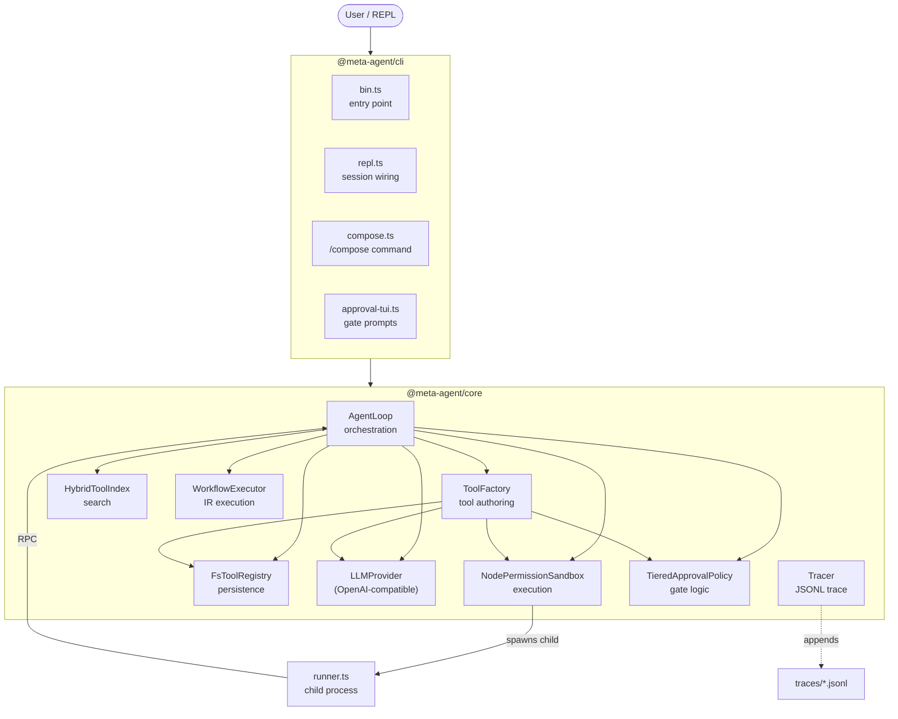
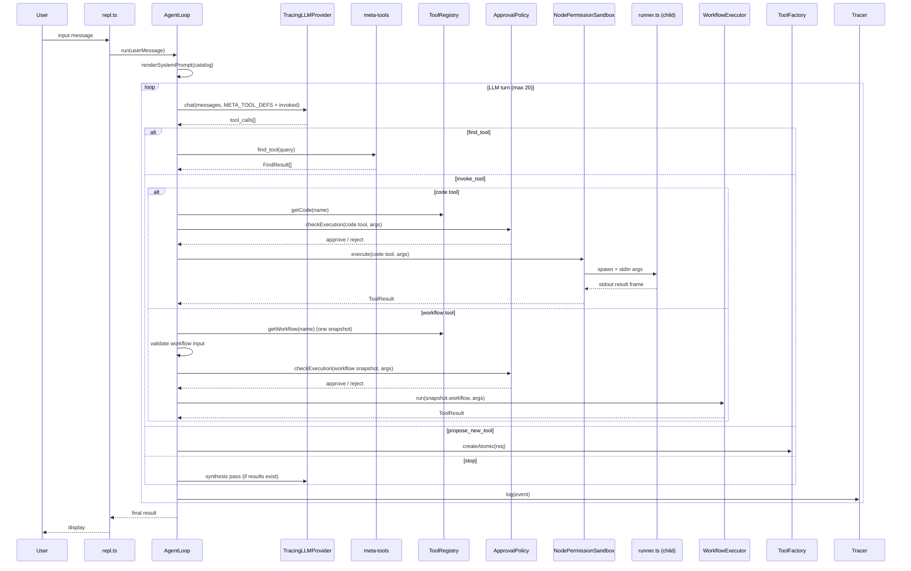
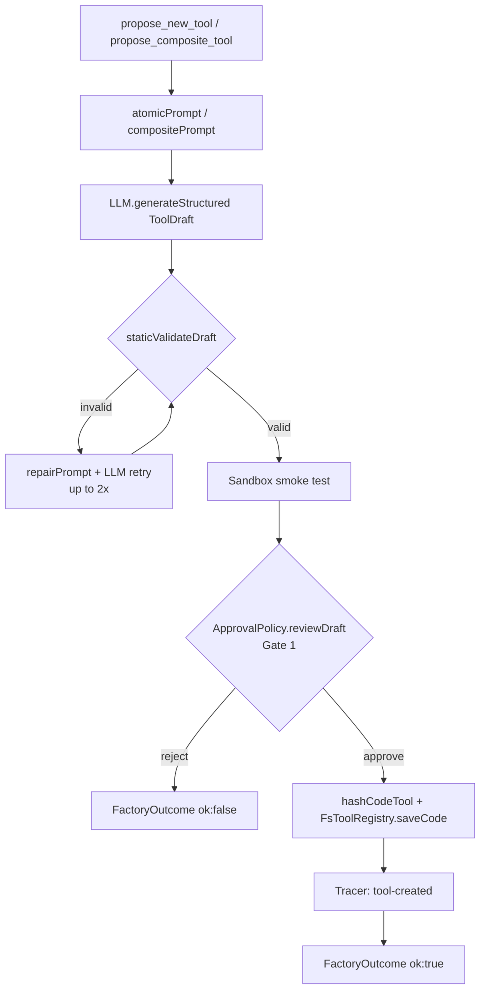
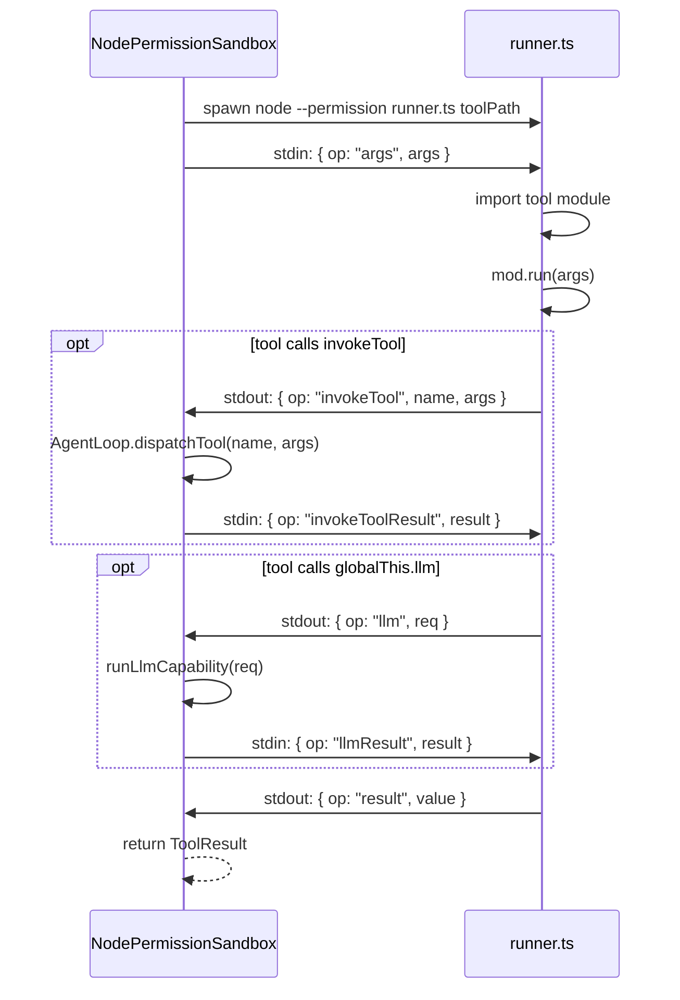
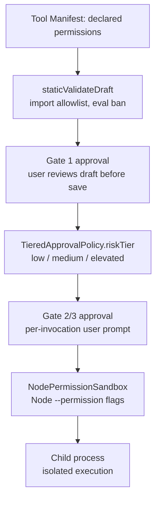
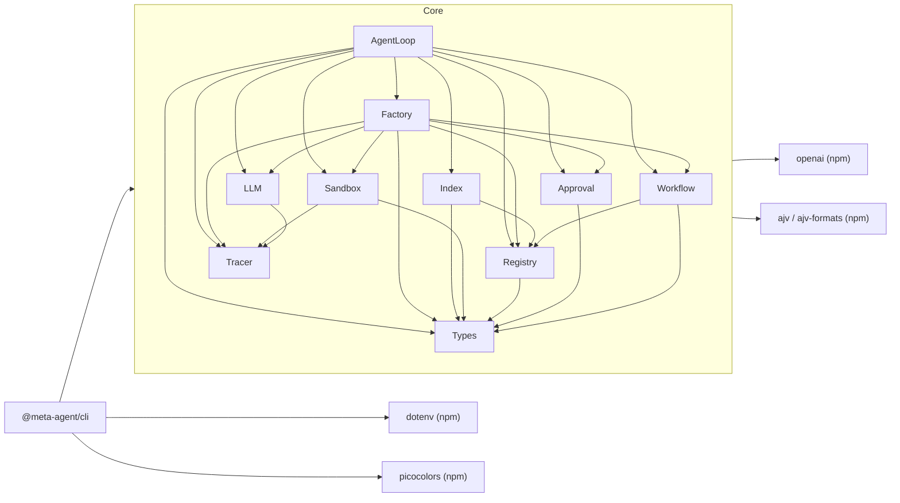

# Repository Structure

`meta-agent` is a TypeScript monorepo (Node >= 25, npm workspaces) that implements a local AI meta-agent. The agent runs an LLM-driven loop, discovers and authors tools, executes them in sandboxed subprocesses, and can compose past invocations into reusable workflow tools.

---

## High-Level Architecture



---

## Package Overview

| Package | Path | Role |
|---------|------|------|
| `@meta-agent/core` | [`packages/core/`](../packages/core) | All domain logic: agent loop, factory, sandbox, registry, index, workflow, LLM, tracing |
| `@meta-agent/cli` | [`packages/cli/`](../packages/cli) | REPL, config loading, approval TUI, compose command |

**Dependency rule:** CLI depends on Core. Core has zero imports from CLI.

---

## Modules

### `@meta-agent/core`

#### types and tool model ([`src/types.ts`](../packages/core/src/types.ts), [`src/tool.ts`](../packages/core/src/tool.ts), [`src/schemas.ts`](../packages/core/src/schemas.ts))

The shared domain model. All other modules depend on these types.

**Responsibilities:**
- Define canonical types for tools, manifests, permissions, results, and errors.
- Provide JSON schemas (`PERMISSIONS_SCHEMA`, `MANIFEST_SCHEMA`, `TOOL_DRAFT_SCHEMA`) for validation.

**Key types:**

| Type | Description |
|------|-------------|
| `ToolManifest` | The durable identity record of a saved tool: its name, input/output schemas, permission requirements, kind, resource limits, and the hash that locks it to an approval record. |
| `CodeKind` | The atomic and composite subset of `ToolKind`. Drafts are code-only, so workflow tools are never represented as code drafts. |
| `CodeTool` | A saved atomic or composite tool: a code-kind manifest paired with TypeScript `code`. |
| `WorkflowTool` | A saved workflow tool: a workflow manifest paired with typed `workflow` IR. |
| `Tool` | The `CodeTool \| WorkflowTool` discriminated union. A workflow is never stored as JSON in `code` or as an empty-code placeholder. |
| `ToolDraft` | The LLM's proposed tool before it has been hashed, tested, or approved. Includes a `smokeTestInput` the factory uses to immediately run a live sandbox test. |
| `Permissions` | The resource footprint a tool declares it needs: filesystem paths it can read or write, whether it can use the network, and which env vars it can access. Drives both risk classification and the subprocess permission flags. |
| `ToolResult` | The universal return value for every tool invocation. Success carries an arbitrary value; failure carries a typed error. All execution paths yield this type. |
| `ToolKind` | Determines how the agent loop dispatches a tool. Atomic and composite tools run in a sandboxed subprocess; workflow tools run through `WorkflowExecutor` in-process. |
| `ToolErrorKind` | The canonical set of failure modes. Lets the agent loop pattern-match on errors to decide whether to inject recovery hints or surface the error to the model. |
| `CatalogEntry` | The minimal slice of a tool shown in the system-prompt catalog. The model reads these to decide which tool to invoke or whether to search further with `find_tool`. |
| `FindResult` | A ranked search hit from `find_tool`, containing enough detail for the model to decide whether to invoke a tool without fetching its full manifest. |
| `ApprovalRecord` | The persisted proof that a user approved a specific version of a tool. Bound to a body hash—code source for code tools or serialized workflow IR for workflows—so any body or manifest change invalidates it and triggers re-approval. |

---

#### Tracer ([`src/tracer.ts`](../packages/core/src/tracer.ts))

**Responsibilities:**
- Append structured events to a JSONL file keyed by session ID.
- Notify registered observers synchronously before each disk write (used for live CLI progress).

**Key exports:**

| Export | Description |
|--------|-------------|
| `Tracer` | The session-level event bus. Every module calls `.log()` to record what it did; the tracer writes to JSONL and notifies observers synchronously, which the CLI uses to render live progress to stderr. |
| `TraceEvent` | The discriminated union that all logged events conform to. Each variant captures the full context for one observable action in the system. |
| `TRACE_KIND_*` constants | Event type discriminants that identify what happened in a trace event (e.g. an LLM turn completed, a tool was invoked, a draft was generated). Used when consuming traces for replay or visualization. |
| `LLM_TRACE_PHASE` | Tags which system context caused an LLM call. Allows traces to distinguish between the model driving the agent loop, the factory generating a draft, the factory repairing a bad draft, and a final synthesis pass. |

**Dependencies:** Node `fs` only.

---

#### Registry ([`src/registry/`](../packages/core/src/registry))

**Responsibilities:**
- Persist and load tools from disk.
- Enforce integrity-aware writes of `manifest.json`, `tool.ts` (or `workflow.json`), and `approval.json`.
- Provide kind-explicit body access and metadata-only reads.

**Key exports:**

| Export | File | Description |
|--------|------|-------------|
| `ToolRegistry` | [`tool-registry.ts`](../packages/core/src/registry/tool-registry.ts) | The persistence contract. `getCode` / `getWorkflow` and `saveCode` / `saveWorkflow` keep body operations kind-explicit; `getManifest` and `getKind` avoid body reads when callers need only metadata. |
| `FsToolRegistry` | [`fs-registry.ts`](../packages/core/src/registry/fs-registry.ts) | The filesystem-backed registry. Stores each tool in its own subdirectory, verifies durable state before caching it, and retains one typed union entry per name. |

- `hash.ts` — owns public `hashCodeTool` / `hashWorkflowTool`, new-save `serializeWorkflowBody`, and package-internal raw-body `hashToolBody`.
- `registry/integrity.ts` — pure content/approval hash verification used at the registry's load/save boundary; Link A uses exact body bytes on load. Link-A failures are `quarantined`; hash-authentic workflows that fail structural parsing are `invalid`.

**Disk layout per tool** (`tools/<name>/`):
- Atomic/composite: `manifest.json` + `tool.ts` + `approval.json`
- Workflow: `manifest.json` + `workflow.json` + `approval.json`

Load and save intentionally have different body contracts. Rehydration hashes
the raw file contents before parsing, so any previously hashed formatting still
verifies. New workflow saves serialize with `serializeWorkflowBody`, structurally
validate before write, and hash exactly those bytes.

**External dependencies:** Node `fs/promises`.

---

#### Tool Index ([`src/index-store/`](../packages/core/src/index-store))

**Responsibilities:**
- Provide semantic search over the tool catalog for the `find_tool` meta-tool.
- Rank results using BM25-lite TF-IDF over name, description, and rationale fields.

**Key exports:**

| Export | File | Description |
|--------|------|-------------|
| `ToolIndex` | [`interface.ts`](../packages/core/src/index-store/interface.ts) | The discovery contract. Provides the `find_tool` meta-tool with ranked search results and the system-prompt builder with the full tool catalog. |
| `HybridToolIndex` | [`hybrid-index.ts`](../packages/core/src/index-store/hybrid-index.ts) | The in-memory TF-IDF search index built at session start from the registry. Scores tools by how well their name, description, and rationale match a natural-language query. |

**Dependencies:** `@meta-agent/core` types and Registry.

---

#### Approval ([`src/approval/`](../packages/core/src/approval))

**Responsibilities:**
- Define two gate types: Gate 1 (tool onboarding) and Gate 2/3 (execution approval).
- Implement risk tier classification.
- Cache per-session execution approvals.
- Support `yolo` mode to auto-approve execution (Gate 1 always prompts).

**Key exports:**

| Export | File | Description |
|--------|------|-------------|
| `ApprovalPolicy` | [`interface.ts`](../packages/core/src/approval/interface.ts) | Enforces the two-gate approval model. `reviewDraft` governs whether a new tool draft may be saved; `checkExecution` governs whether a known tool may run with given arguments. |
| `ApprovalPrompter` | [`interface.ts`](../packages/core/src/approval/interface.ts) | The injected UI hook that presents approval decisions to the user. Decouples policy logic from UI; the CLI injects `CliApprovalPrompter` via readline. |
| `TieredApprovalPolicy` | [`tiered-policy.ts`](../packages/core/src/approval/tiered-policy.ts) | The concrete policy that classifies each tool by risk tier, prompts the user accordingly, and caches per-session approvals to avoid re-prompting identical calls. |
| `RISK_TIER` | [`interface.ts`](../packages/core/src/approval/interface.ts) | The three-level classification that controls how much scrutiny a tool execution receives. `elevated` tools have broad permissions (net access, out-of-workspace paths) and always prompt regardless of `yolo`. |
| `Gate1Decision` | [`interface.ts`](../packages/core/src/approval/interface.ts) | The user's response after reviewing a new tool draft: approve once, approve always (cached to disk), or reject with a reason. An `editedDraft` field lets the user modify the draft inline before saving. |
| `ExecutionDecision` | [`interface.ts`](../packages/core/src/approval/interface.ts) | The user's response to an execution approval request: approve this invocation, cache the approval for the session, or reject. Carries an `ApprovalToken` for audit on approval. |

**Risk escalation rules:** net access, paths outside workspace, secret-named env vars raise tier to `elevated`.

---

#### LLM Provider ([`src/llm/`](../packages/core/src/llm))

**Responsibilities:**
- Abstract the LLM behind a provider interface for testability.
- Support structured-output generation and streaming chat.
- Wrap providers with tracing and debug-sink decorators.

**Key exports:**

| Export | File | Description |
|--------|------|-------------|
| `LLMProvider` | [`LLMProvider.ts`](../packages/core/src/llm/LLMProvider.ts) | The interface all LLM access goes through. Supports multi-turn chat with tool definitions and single-call structured JSON output generation. Injected everywhere and replaceable with a mock for tests. |
| `ChatMessage`, `ToolDef`, `ToolCall` | [`LLMProvider.ts`](../packages/core/src/llm/LLMProvider.ts) | The wire types for LLM communication: messages in the conversation history, tool schema definitions sent to the model, and the tool-call responses the model returns. |
| `OpenAIProvider` | [`openai-provider.ts`](../packages/core/src/llm/openai-provider.ts) | Production LLM implementation using the OpenAI SDK. Supports a custom `baseURL` for compatible endpoints and an optional debug sink for logging raw payloads. |
| `TracingLLMProvider` | [`tracing-provider.ts`](../packages/core/src/llm/tracing-provider.ts) | A transparent decorator that records every LLM request and full response as an `llm-call` trace event. Wraps any `LLMProvider` without changing its behavior. |
| `MockLLMProvider` | [`mock-provider.ts`](../packages/core/src/llm/mock-provider.ts) | A test double that returns scripted responses in sequence, enabling deterministic unit and integration tests without a live LLM. |

**External dependencies:** `openai` SDK.

---

#### Sandbox ([`src/sandbox/`](../packages/core/src/sandbox))

**Responsibilities:**
- Execute tool code in an isolated Node child process with `--permission` flags.
- Implement a stdio-based JSON RPC protocol between host and child.
- Handle `invokeTool` and `llm` capability requests from tools running in the child.
- Enforce timeout and output-size limits.

**Key exports:**

| Export | File | Description |
|--------|------|-------------|
| `Sandbox` | [`sandbox.ts`](../packages/core/src/sandbox/sandbox.ts) | The execution contract for `CodeTool`s. It runs code tools in isolation and returns a `ToolResult`; workflows execute in-process through `WorkflowExecutor`. |
| `NodePermissionSandbox` | [`node-permission-sandbox.ts`](../packages/core/src/sandbox/node-permission-sandbox.ts) | Re-verifies Link A over a `CodeTool` before spawning, returning `permission_denied` on mismatch; otherwise it spawns a fresh Node child with manifest-derived permission flags, timeouts, and output caps. |
| `runner.ts` | [`runner.ts`](../packages/core/src/sandbox/runner.ts) | The child process entry. Imports the tool module, routes `invokeTool` and `llm` capability requests from the tool back to the host via stdio RPC, and emits the final result frame. |
| `SANDBOX_STDIO_OP` | [`stdio-protocol.ts`](../packages/core/src/sandbox/stdio-protocol.ts) | The opcode enum for the parent-child JSON RPC protocol. Each value identifies the purpose of a frame in the stdio stream (`args`, `invokeTool`, `invokeToolResult`, `llm`, `llmResult`, `result`). |

**Subprocess flags:** `--permission --allow-fs-read=... --allow-fs-write=... --allow-net=...`

**External dependencies:** Node `child_process`.

---

#### Tool Factory ([`src/factory/`](../packages/core/src/factory))

**Responsibilities:**
- Drive the LLM to generate a `ToolDraft` from an intent description.
- Perform static validation (import allowlist, `eval` ban, `invokeTool` dep checks).
- Run a smoke test in the sandbox.
- Obtain Gate 1 approval and persist the tool.
- Lift session invocations into a workflow IR (delegating to the workflow module).

**Key exports:**

| Export | File | Description |
|--------|------|-------------|
| `ToolFactory` | [`factory.ts`](../packages/core/src/factory/factory.ts) | Orchestrates the full tool creation pipeline from intent to saved tool: LLM draft generation, static validation, smoke testing, user approval, and registry persistence. |
| `CreateAtomicReq` | [`factory.ts`](../packages/core/src/factory/factory.ts) | Input for requesting a brand-new tool from scratch. Carries the user's intent, the model's rationale for needing a new tool, and the list of existing tools already considered. |
| `CreateCompositeReq` | [`factory.ts`](../packages/core/src/factory/factory.ts) | Input for requesting a tool that chains existing tools in sequence. Includes an explicit step plan so the LLM has a blueprint of which tools to call and in what order. |
| `CreateWorkflowReq` | [`factory.ts`](../packages/core/src/factory/factory.ts) | Input for saving a workflow from a session slice. Carries the invocations to lift, the desired name and description, and any literal-to-input promotions the user chose. |
| `PreviewWorkflowOutcome` | [`factory.ts`](../packages/core/src/factory/factory.ts) | The result of a workflow preview before saving: either a complete `Workflow` IR plus the list of literal values that could be promoted to named inputs, or a failure reason. |
| `FactoryOutcome` | [`factory.ts`](../packages/core/src/factory/factory.ts) | The result of any tool creation attempt: either the saved `Tool` paired with its `ApprovalRecord`, or a failure reason explaining why the tool was not persisted. |
| `staticValidateDraft` | [`static-validator.ts`](../packages/core/src/factory/static-validator.ts) | Performs static analysis on LLM-generated code before any execution. Rejects forbidden imports (`child_process`, etc.), `eval` usage, and undeclared `invokeTool` dependencies. |

**Dependencies:** LLMProvider, ToolRegistry, Sandbox, ApprovalPolicy, Tracer, workflow module.

---

#### Agent Loop ([`src/agent/`](../packages/core/src/agent))

**Responsibilities:**
- Run the main turn loop: build system prompt, call LLM, dispatch tool calls.
- Expose six meta-tools to the LLM for discovery, invocation, and tool authoring.
- Manage the `ResultStore` for reference passing between tool calls.
- Inject recovery hints when `invoke_tool` fails or `find_tool` returns empty.
- Trigger a synthesis LLM pass when the model stops after producing tool results.

**Key exports:**

| Export | File | Description |
|--------|------|-------------|
| `AgentLoop` | [`agent-loop.ts`](../packages/core/src/agent/agent-loop.ts) | Drives the LLM turn loop, dispatches meta-tool calls, executes real tools through the sandbox, and returns the final response to the REPL. |
| `AgentLoopOpts` | [`agent-loop.ts`](../packages/core/src/agent/agent-loop.ts) | The constructor dependency bag. All external capabilities (LLM, registry, sandbox, approval, etc.) are injected here, making the loop fully testable without live infrastructure. |
| `META_FN` | [`meta-tools.ts`](../packages/core/src/agent/meta-tools.ts) | String-constant names for the six meta-tools. Used as the switch key in the dispatch logic and in the recovery hint messages injected after failures. |
| `META_TOOL_DEFS` | [`meta-tools.ts`](../packages/core/src/agent/meta-tools.ts) | The tool schema definitions injected into every LLM turn so the model knows which meta-tools it can call and what arguments each accepts. |
| `ResultStore` | [`result-store.ts`](../packages/core/src/agent/result-store.ts) | Stores depth-0 tool outputs under auto-generated binding names and resolves `{ $ref }` pointers in later tool arguments. Prevents large payloads from reappearing in the model context on every turn. |
| `renderSystemPrompt` | [`system-prompt.ts`](../packages/core/src/agent/system-prompt.ts) | Builds the system prompt from the current tool catalog. Tells the model what tools exist and how to use meta-tools to discover, invoke, and author them. |
| `seedBuiltins` | [`builtins.ts`](../packages/core/src/agent/builtins.ts) | Installs the built-in `llm_generate` tool into the registry at session startup. This tool lets any other tool use the LLM as a pure data transformer via `globalThis.llm`. |

**Dependencies:** All core modules.

---

#### Workflow ([`src/workflow/`](../packages/core/src/workflow))

**Responsibilities:**
- Define the workflow intermediate representation (IR) — v1 is a linear sequence of `tool_call` steps.
- Lift a slice of session invocations into a workflow IR deterministically.
- Optionally promote literal arguments to named workflow inputs.
- Validate a workflow against the registry.
- Execute a workflow by dispatching each step via a provided `DispatchTool` callback.
- Render a human-readable description of a workflow.

**Key exports:**

| Export | File | Description |
|--------|------|-------------|
| `Workflow` | [`types.ts`](../packages/core/src/workflow/types.ts) | The persisted IR for a workflow tool. Captures declared inputs, an ordered list of steps, and how results flow between steps and back to the caller. |
| `ToolCallStep` | [`types.ts`](../packages/core/src/workflow/types.ts) | A single step in a workflow: which tool to invoke, what arguments to pass (as inline literals or references to earlier bindings), and what name to give the result. |
| `SymRef` | [`types.ts`](../packages/core/src/workflow/types.ts) | A reference to a prior binding in the workflow execution scope. Allows a step's argument to be wired to an earlier step's output or to a declared workflow input, expressing data flow without copying values. |
| `WorkflowInput` | [`types.ts`](../packages/core/src/workflow/types.ts) | A declared parameter that callers must supply when invoking the workflow tool. Created when a lifted literal is promoted during the compose interaction. |
| `liftFromTrace` | [`lift.ts`](../packages/core/src/workflow/lift.ts) | Converts a slice of session invocations into a workflow IR deterministically. Preserves data flow by turning `ResultStore` bindings into `SymRef` nodes. |
| `parameterize` | [`parameterize.ts`](../packages/core/src/workflow/parameterize.ts) | Replaces selected literal values in a workflow with named `WorkflowInput` parameters so the workflow can be called with different data without editing the IR. |
| `WorkflowExecutor` | [`executor.ts`](../packages/core/src/workflow/executor.ts) | Runs a workflow step by step, resolves bindings, and dispatches each tool via the injected callback. This re-enters the agent loop's own dispatch path so sandboxing and approval apply normally. |
| `validate` | [`validator.ts`](../packages/core/src/workflow/validator.ts) | Checks that a workflow IR is self-consistent and that every referenced tool exists in the registry with a compatible input schema. |
| `renderLiterate` | [`renderer.ts`](../packages/core/src/workflow/renderer.ts) | Produces a readable English description of a workflow for display in the compose interaction and tool listings. |

---

### `@meta-agent/cli`

#### Entry and REPL ([`src/bin.ts`](../packages/cli/src/bin.ts), [`src/repl.ts`](../packages/cli/src/repl.ts))

**Responsibilities:**
- Parse CLI flags (`--config`, `--yolo`, `--debug`).
- Load config and environment variables.
- Instantiate and wire all core components.
- Run the interactive REPL loop: dispatch commands or forward to `AgentLoop`.

**Key exports:**

| Export | File | Description |
|--------|------|-------------|
| `main` | [`bin.ts`](../packages/cli/src/bin.ts) | The CLI entry point. Parses flags, loads config and `.env` files, sets up debug sinks, and hands off to `runRepl`. |
| `runRepl` | [`repl.ts`](../packages/cli/src/repl.ts) | Initializes the session directories, creates the session, and runs the interactive input loop until the user exits. |
| `createReplSession` | [`repl.ts`](../packages/cli/src/repl.ts) | Constructs and wires all core objects (registry, index, sandbox, LLM, factory, agent loop) into a ready-to-use session. The composition root of the application. |

---

#### Config ([`src/config.ts`](../packages/cli/src/config.ts))

**Responsibilities:**
- Load and validate the JSON config file.
- Resolve relative paths for `toolsDir`, `workspace`, `tracesDir`.

**Key exports:**

| Export | Description |
|--------|-------------|
| `Config` | The runtime configuration for a session: LLM endpoint and model, directory paths for tools/workspace/traces, turn limits, sandbox constraints, and the `yolo` flag. |
| `loadConfig(path)` | Reads and validates the JSON config file, resolves relative paths to absolute, and applies defaults for optional fields. |

**Config fields:**
```
llm.baseURL, llm.model, llm.apiKeyEnv
workspace, toolsDir, tracesDir
yolo, maxTurns
sandbox.maxDepth, sandbox.maxOutputBytes
```

---

#### Compose ([`src/compose.ts`](../packages/cli/src/compose.ts))

**Responsibilities:**
- Collect `InvocationRecord` items from the agent session.
- Present the user with a slice-selection prompt.
- Drive `ToolFactory.previewWorkflow` and `ToolFactory.createWorkflow`.
- Optionally prompt for literal-to-input promotions.

**Key exports:** `runComposeInteraction(invocations, factory)`, `InvocationRecord`

---

#### Approval TUI ([`src/approval-tui.ts`](../packages/cli/src/approval-tui.ts), [`src/approval-format.ts`](../packages/cli/src/approval-format.ts), [`src/approval-display.ts`](../packages/cli/src/approval-display.ts))

**Responsibilities:**
- Implement `ApprovalPrompter` using readline.
- Format Gate 1 (tool onboarding) and Gate 2/3 (execution) prompts.
- Render permissions and arguments as terminal tables.

**Key exports:** `CliApprovalPrompter`, `formatPermissionsTable`, `formatArgsTable`

---

#### Terminal Utilities ([`src/trace-progress.ts`](../packages/cli/src/trace-progress.ts), [`src/terminal-theme.ts`](../packages/cli/src/terminal-theme.ts), [`src/terminal-table.ts`](../packages/cli/src/terminal-table.ts), [`src/terminal-write.ts`](../packages/cli/src/terminal-write.ts))

**Responsibilities:**
- Format and write live progress lines to stderr from trace events.
- Provide color tokens and table rendering.

---

## Main Flows

### Agent Execution



---

### Tool Creation (Atomic / Composite)



---

### Compose: Session to Workflow Tool

```mermaid
flowchart TD
    A[/compose command] --> B[User selects invocation slice]
    B --> C[ToolFactory.previewWorkflow]
    C --> D[liftFromTrace invocations]
    D --> E{Literal fallbacks?}
    E -- yes --> F[User selects promotions]
    F --> G[parameterize workflow]
    E -- no --> G
    G --> H[validateWorkflow against registry]
    H --> I[ToolFactory.createWorkflow]
    I --> J[Gate 1 approval]
    J --> K[hashWorkflowTool + FsToolRegistry.saveWorkflow]
    K --> L[New workflow tool available]
```

---

### Sandbox Subprocess Protocol



---

## Cross-Cutting Concerns

### Tracing and Logging

All observable events flow through a single `Tracer` instance per session. The tracer:

1. Appends structured `TraceEvent` records to `traces/<iso>-<sessionId>.jsonl`.
2. Notifies synchronous observers before each write (used by the CLI to write live progress to stderr).

The `TracingLLMProvider` decorator wraps every LLM call and emits full `llm-call` events with request/response payloads.

Debug output is layered separately:

| Layer | Env var / flag | Output |
|-------|---------------|--------|
| LLM payloads | `META_AGENT_DEBUG=1` / `--debug` | stderr via `DebugSink` |
| Sandbox child/parent | `META_AGENT_SANDBOX_DEBUG` | `writeSandboxLogLine` to stderr |
| Registry load issues | `META_AGENT_REGISTRY_DEBUG` | stderr |

---

### Security and Permissions

The security model operates at three layers:



| Layer | Mechanism |
|-------|-----------|
| Static analysis | `staticValidateDraft` rejects forbidden imports (`child_process`, `eval`, etc.) |
| Manifest declaration | Tools declare exactly which FS paths, net mode, and env vars they need |
| Risk classification | `riskTier()` escalates tools with net access, out-of-workspace paths, or secret-named env vars |
| Approval gates | Gate 1 always prompts for new tools; `yolo` only skips Gate 2/3 execution prompts |
| Process isolation | `--allow-fs-read`, `--allow-fs-write`, `--allow-net` map manifest fields to Node permission flags |
| Hash verification | Link A hashes body bytes against the manifest and Link B binds approval; raw-body mismatch quarantines an entry, structural workflow parse failure is `invalid`, and the sandbox rechecks Link A before code execution |

---

### Error Handling

The repo uses a unified result type throughout:

```typescript
type ToolResult =
  | { ok: true; value: unknown }
  | { ok: false; error: ToolError };
```

Error propagation rules:
- The sandbox child never throws across the process boundary; it always emits a `result` frame with `ok: false`.
- `AgentLoop` injects synthetic recovery messages when `invoke_tool` fails or `find_tool` returns empty, steering the LLM toward corrective action.
- `ToolFactory` returns `{ ok: false, reason }` on validation or approval failure and logs a `tool-rejected` trace event.
- The CLI [`bin.ts`](../packages/cli/src/bin.ts) catches top-level errors and exits with code 1.

---

### Reference Passing

Depth-0 tool results (results from the outermost `invoke_tool` call) are stored in a `ResultStore` under auto-generated binding names like `r_0_toolname`. The model sees compact handles via `describeForModel()` instead of raw payloads. Subsequent tool calls can pass `{ "$ref": "r_0_...", "path": "key" }` to forward a previous result or a subfield of it.

The workflow lifter uses the same binding names when constructing `SymRef` nodes in the IR, so a composed workflow correctly wires data flow between steps.

---

### Configuration and Environment

Config is loaded from a JSON file (default path resolved from `--config` flag):

```json
{
  "llm": { "baseURL": "...", "model": "...", "apiKeyEnv": "OPENAI_API_KEY" },
  "workspace": "./workspace",
  "toolsDir": "./tools",
  "tracesDir": "./traces",
  "yolo": false,
  "maxTurns": 20,
  "sandbox": { "maxDepth": 3, "maxOutputBytes": 102400 }
}
```

Environment variables:

| Variable | Purpose |
|----------|---------|
| `OPENAI_API_KEY` (or `llm.apiKeyEnv`) | LLM API key |
| `META_AGENT_DEBUG` | Enable LLM payload debug output |
| `META_AGENT_SANDBOX_DEBUG` | Enable sandbox communication logging |
| `META_AGENT_REGISTRY_DEBUG` | Enable registry diagnostic logging |
| `META_AGENT_NET_ALLOWLIST` | Injected into sandbox child for fetch allowlist |

---

## Module Dependency Map


